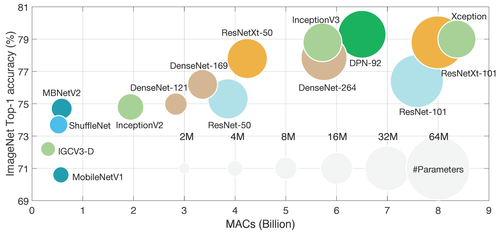

# Lecture 07: Neural Architecture Search (Part I)

## Note Information

| Title       | Neural Architecture Search (Part I)                                                    |
|-------------|-----------------------------------------------------------------------------------------------------------------|
| Lecturer    | Song Han                                                                                                        |
| Date        | 09/29/2022                                                                                                      |
| Note Author | Alex Quach (aquach)                                                                                                 |
| Description |  |

## Subtitle

This is a template of the lecture note.

The figure above comes from [[Deng *et al.*, 2020]](https://ieeexplore.ieee.org/document/9043731).

## Overview of the Course Information

This is a template of the lecture note.
