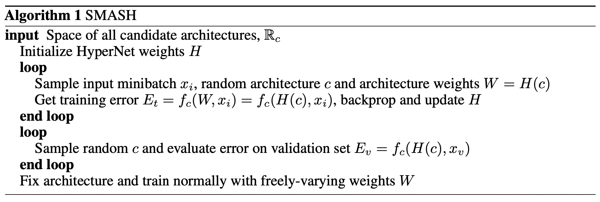
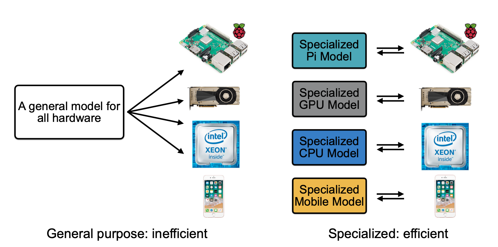
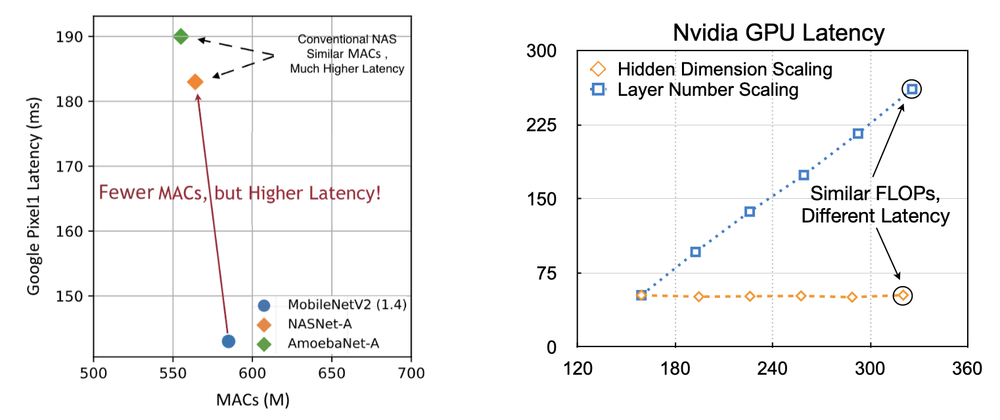
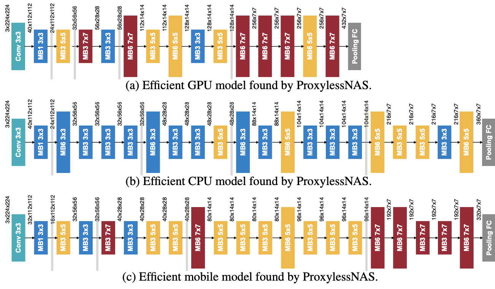
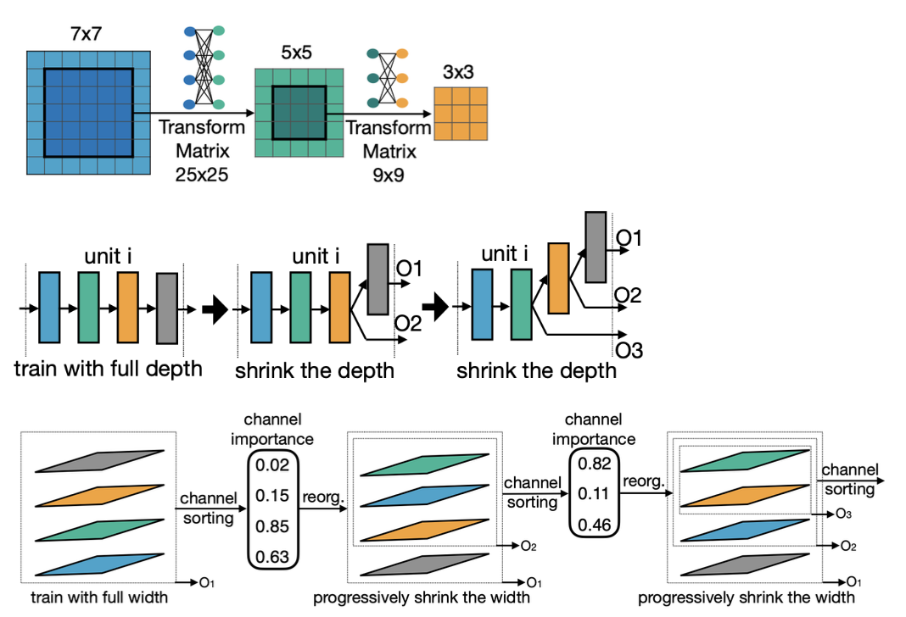
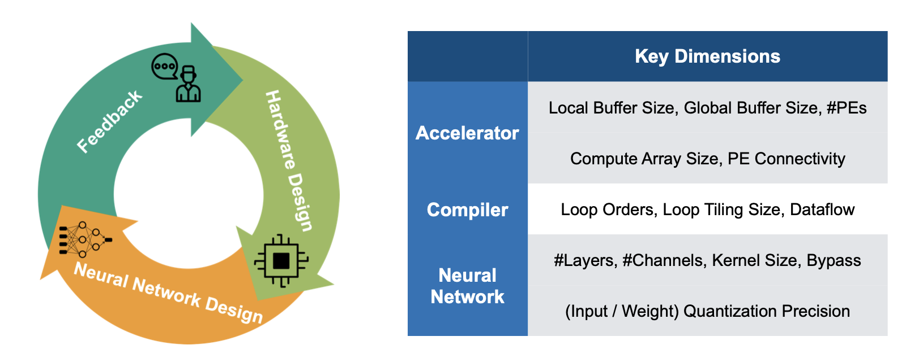
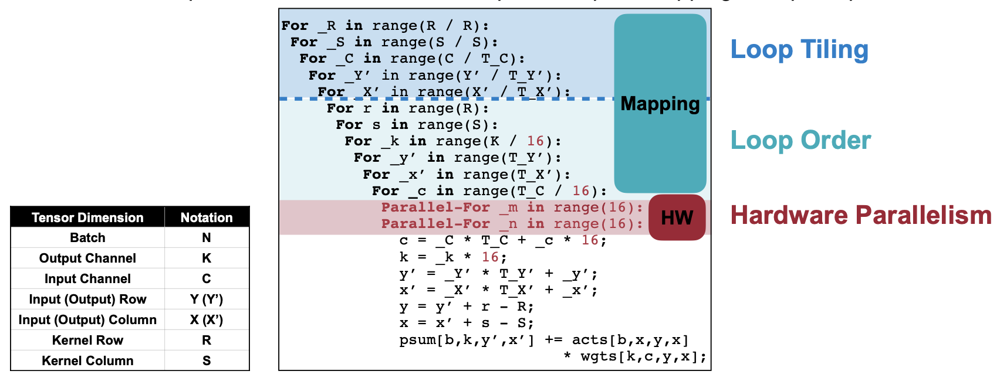
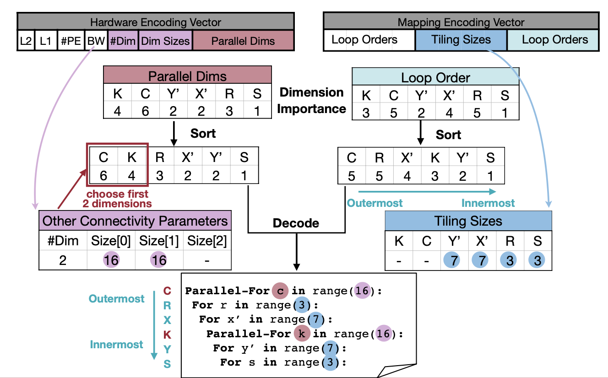
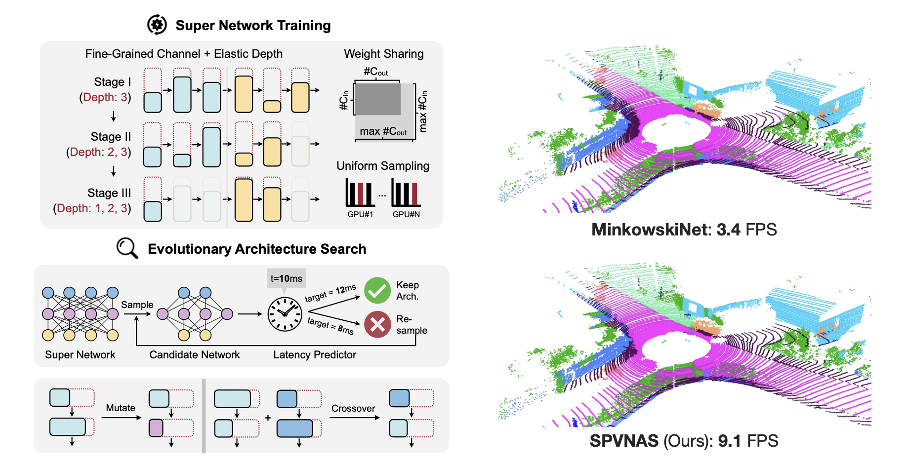
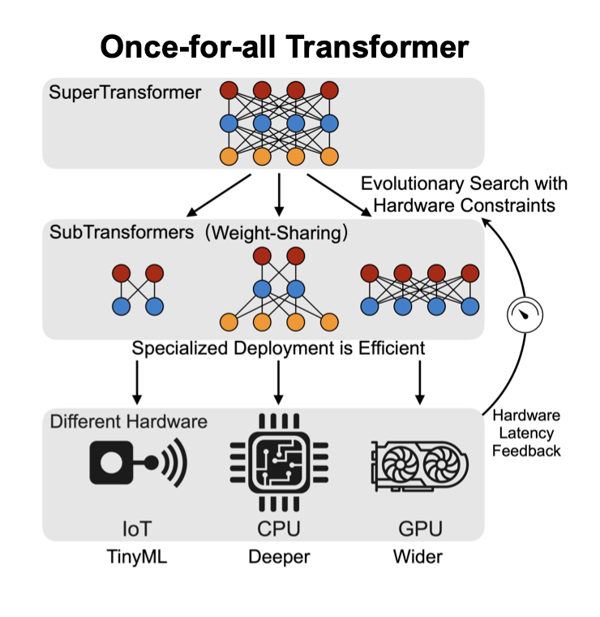

# Lecture 08: Neural Architecture Search - Part II

## Note Information

| Title       | Neural Architecture Search - Part II                                                                            |
|-------------|-----------------------------------------------------------------------------------------------------------------|
| Lecturer    | Song Han                                                                                                        |
| Date        | 10/04/2022                                                                                                      |
| Note Author | Nicolas Filliol (nfilliol)                                                                                      |
| Description | Discuss performance estimation strategies; introduce hardware-aware neural architecture search; introduce the application of NAS in downstream tasks.|

## Performance Estimation in NAS
### Train from Scratch
- Randomly sampled model architectures can be trained from scratch on the training set.
- The trained model is then evaluated on a validation set to get accuracy $R$.
- Drawback of this simple approach is its prohibitve training cost, as potentially a large amount of GPU hours is required or must be compensated with a smaller design space or training dataset.
- Instead we look for more efficient alternatives for accuracy estimation.

### Weight Inheritance
One option for optimization is to inherit weights from pre-trained models to reduce the training cost of new architectures to be searched. Two main approaches exist [[Chen *et al.*, ICLR 2016]](https://arxiv.org/abs/1511.05641):
* Net2Wider: Duplicate a node within a layer including its input weights and halve the output weights to not change the total behavior.
* Net2Deeper: Add layers that are initialized as a identity mapping to the network.

In a next step, these adjusted architectures can then be fine-tuned  much more efficiently from their parents instead of being trained from scratch. Instead of directly generating new model architectures, network transformation actions are generated to update the model architecture [[Cai *et al.*, AAAI 2018]](https://arxiv.org/abs/1707.04873).

### HyperNetwork: Weight Generator
Instead of training every new model architecture, a hypernetwork can be trained once to generate weights for the sampled model architectures. The following algorithm describes the procedure [[Brock *et al.*, ICLR 2018]](https://arxiv.org/abs/1708.05344):

At each training step, a random model architecture is sampled from the search space and the HyperNet is used to generate a set of weights. Using gradient descent, the entire system is trained end-to-end. When training is finished, multiple model architectures are randomly sampled and evaluated using weights generated by the HyperNet. The model achieving the best evaluation results is then used and trained normally. Other variants using graph neural networks for the hypernetwork exist such as proposed by [[Zhang *et al.*, ICLR 2019]](https://arxiv.org/abs/1810.05749). Their Graph HyperNetwork models the topology of a network to improve estimation of performance.

### Weight Sharing
Another possible way to reduce the cost of neural architecture search is to use of weight sharing. By training a super-network first and then sampling subgraphs from this network, a model architecture search can be performed. The best-performing sub-network is then retrained from scratch [[Pham *et al.*, ICML 2018]](https://arxiv.org/abs/1802.03268).

### Performance Estimation Heuristics
Heuristics are used to obtain an estimation of the performance of an architecture with no training at all. An example for such a heuristic ZenNAS [[Lin *et al.*, ICCV 2021]](https://arxiv.org/abs/2102.01063):
1. Initialize the random input $x \sim \mathcal{N}(0, 1)$
2. Add a small perturbation to $x$ and obtain $x' = x + \epsilon$
3. Initialize all the weights of the neural network $f$ to a normal distribution $\mathcal{N}(0,1)$
4. Calculate the log difference: $z_1 = \log(f(x')-f(x))$\
A good model should be **sensitive** to input perturbations.
5. Add a compensation term for batch normalization layers:\
Consider BN for layer $i$: $x_i = (x_i - \mu_i)/\sigma_i$\
Calculate square mean: $\bar{\sigma}_i = \sqrt{\frac{\sum_j \sigma_{i,j}^2}{c_{\text{out}}}}$ where the sum $j$ is over output channels. \
Define $z_2 = \sum_i \log(\bar{\sigma_i})$ and **zen score** $z = z_1 + z_2$.

The Zen-Score can be used as a proxy for the expressivity of the network and positively correlates with the network accuracy.

Another example for a heuristic is GradSign [[Zhang and Jia, ICLR 2022]](https://www.cs.cmu.edu/~zhihaoj2/papers/gradsign-iclr22.pdf). The intuition for this heuristic is that a good model has **denser** sample-wise local minima for parameter $\theta$ (i.e. for single datapoints $x_i$), meaning that two local minima points $\theta_1^*$ and $\theta_2^*$ should be closer. This suggests that the probability that the gradients of different samples have the same sign is higher in figure (b). We can leverage this intuition to heuristically find better models using a small number of samples to compute gradient densities. The implementation of the algorithm is given below:

## Hardware-Aware NAS
Instead of having a general model for all hardware, hardware-aware neural architecture search tries to efficiently find specialized models for different hardware.

## Efficiently Search on Target Task & Hardware
Previous neural architecture search is very expensive, for example NASNet requires 48,000 GPU hours even on CIFAR corresponding to approximately 5 years on a single GPU. But also huge memory requirements are a potential issue, for example DARTS requires 100GB GPU memory for direct search on ImageNet. Therefore, previous work relied on *proxy tasks* to reduce the costs of training and search such as:
* smaller datasets such as CIFAR-10
* small architecture space (e.g. low depth)
* fewer epochs for training
* Flops and parameter counts
These architectures optimized for the proxy tasks are not guaranteed to perform optimally on the target tasks.

ProxylessNAS proposes an option to make the search more efficient such that utilizing these proxy tasks becomes unnecessary [[Cai *et al.*, ICLR 2019]](https://arxiv.org/abs/1812.00332). By building an over-parameterized network including all candidate paths, NAS is simplified to a single training process of this over-parameterized network. Redundant paths can then be pruned based on architecture parameters. However, naively including all candidate paths would lead to an explosion of GPU memory requirements. To reduce the memory footprint, entire paths are binarized by using the architecture parameters as probabilities for sampling a single path, effectively reducing the memory requirement to the same level of training a compact model.

### Latency Prediction
Another problem for effiecient model search is that the number of MACs must not necessarily represent the real hardware efficiency (see example below) [[Wang *et al.*, ACL 2020]](https://arxiv.org/abs/2005.14187). 

To get an accurate estimate of the latency, the latency of the searched NN architecture must be measured on the target hardware itself and ideally, repeated many times to increase the validity of the result. This is a very expensive process. Instead, another approach proposed is to predict latency using a model based on a latency dataset (architecture, latency) to  get a fast and low cost estimate of latency. This can be achieved by using layer-wise latency profiling where effectively, the goal is to train a latency lookup table where input featues include the type of operator, input and output of feature map size and other attributes such as kernel size or stride [[Cai *et al.*, ICLR 2019]](https://arxiv.org/abs/1812.00332). Alternatively, network-wise latency profiling aims to predict latency for the entire network directly [[Wang *et al.*, ACL 2020]](https://arxiv.org/abs/2005.14187).

Incorporating latency prediction can yield optimized results by finding specialized models for different hardware. Results of ProxylessNAS show up to 1.83x latency reduction on mobile by using specialized models. The improvement on GPU is even larger and the final architecture found by the algorithm for different hardware is shown below [[Cai *et al.*, ICLR 2019]](https://arxiv.org/abs/1812.00332):

### Once-for-All Network
Existing models are heavily optimized for GPUs but don't fit well on other platforms. Rather than training each network from scratch for multiple devices, we must ask ourselves how we can train multiple models at the same time. The naive approach looks like this:

1. Train a network, get accuracy and latency
2. Repeat, select best

This is a very expensive process because a new network is trained from scratch in step 1 in every iteration. Optimally, a cheaper approach is used:

1. Train a once-for-all network, sparsely activated
2. Select sub-network, get accuracy and latency
3. Repeat 2, select best

Although a larger, costlier once-for-all network is trained, the cost is amortortized by the fact that many smaller sub-networks can be selected from it without the need for retraining the model [[Cai *et al.*, ICLR 2020]](https://arxiv.org/abs/1908.09791). OFA can thus design specialized neural network models for diverse hardware platforms and fit diverse hardware constraint without the need of retraining the models. Examples for differing constraints might be newer and older processors, different memory constraints or even full battery vs. battery-saving mode.

By progressively shrinking different design choises ot the network, the once-for-all network can be steered into learning subnetworks. Several options for progressive shrinking exist such as:
1. Kernel Size
2. Number of Layers
3. Number of Channels

Another interesting result is the increased arithmetic density (OPS/Byte) of OFA designed models. Computation is cheap and memory is expensive, so this is a welcoming result because it makes it less memory bounded and higher utilization and performance can be achieved without changing the RTL for custom hardware. 

## Neural Hardware Architecture Search
### Design Spaces
Both neural architecture but also custom accelerator architecture design are essential to enable specialization and acceleration to make neural networks as efficient as possible. Hardware-Aware Neural Architecture Search as described above only focus on off-the-shelf hardware and thus neglect the freedom in the hardware desing space. Neural Hardware Architecture Search (NHAS) deals with also optimizing design parameters of the accelerator architecture for customized hardware. This results in a huge design space (see below), wherefore a data-driven approach is desireable. 

Integrating both the search for an optimal accelerator as well as an optimal neural architecture in one single optimization loop offers highly matched solutions.

As an example, convolution loop nests can be divided into two parts [[Lin *et al.*, DAC 2021]](https://arxiv.org/abs/2105.13258):
* temporal mapping
* spatial parallelism

Several parameters for the architecture design are part of the pseudocode above. Some examples are the number, size and selection of the parallel dimensions, the tiling sizes and the loop order.

### Encoding Non-Numerical Parameters
Selecting loop order and parallel dimensions can't be learned directly because they are both non-numerical. Instead, index based encoding can be used to represent different loop orders for example. In this approach, an increment or decrement of the index value does not convey any physical information.

| Non-Numerical Parameters | Numerical Encoding Value Index |
|:------------------------:|:------------------------------:|
|          CRXKYS          |                0               |
|          CXYRSK          |                1               |
|            ...           |               ...              |

Note that for the left column, `CRXKYS` suggests that we first loop over the input channel dimension (C), then the kernel row (R) and so on.

Another approach is **importance-based encoding**.
1. Fix the dimension position in the encoding vectors.
2. Optimizer assigns numerical importance to these dimensions (by sampling based on a multivariate normal distribution).
3. Sort the dimensions by the importance value in decreasing order to get the final optimal loop order and/or select the highest the dimensions with the highest importance score for parallelism.

### Jointly Optimize Neural Network, Mapping and Accelerator
Combining all of the elements of neueral architecture search results in a highly interleaved process. These joint optimization of all building blocks - neural network, mapping and accelerator - offers the possibility to design highly efficient architectures [[Lin *et al.*, DAC 2021]](https://arxiv.org/abs/2105.13258).

Compared to searching the architectural sizing of the network only, also searching the connectivity parameters and mapping strategies achieves considerable reduction in the energy delay product (EDP). Not only does neural accelerator architecture search (NAAS) offer better solutions than the baseline, it also outperforms human design. [[Lin *et al.*, DAC 2021]](https://arxiv.org/abs/2105.13258) show that the optimal parallelization scheme found by NAAS is completely different from a standard human design. 

## Applications of NAS
### NAS for Point Cloud Understanding
Autonomous cars and robots need to understand 3D scenes efficiently and accurately to enable safe interaction with the environment. However, given their limited hardware resources, many state-of-the-art 3D perception models run too slow and low-resolution voxelization and aggressive downsampling is required to compensate for that, which comes at the cost of reduced accuracy. [[Tang *et al*, ECCV 2020]](https://arxiv.org/abs/2007.16100) developed a new model based on 3D Neural Architecture Search. It outperforms the baseline (MinkowskiNet) by 3.3% and achieves 8x computation reduction and a 2.7x speedup in terms of frames per second.

### NAS for Transformers and NLP
Transformers are on of the most common architectures for natural language processing (NLP). They require very intensive computation which makes it difficult to enable low-latency inference on resource-constrained hardware. [[Wang *et al*, ACL 2020]](https://arxiv.org/abs/2005.14187) propose the use of a once-for-all network to search for specialized models for different hardware requirements. On a Raspberry Pi, their specialized model HAT is 2.7x faster, 3.7x smaller, 3.2x fewer FLOPs and there is a 10,1048x reduction in search cost to find this specialized model.

### NAS for Anycost GAN
Similarly, generative adversarial networks (GAN) are computationally very intensive which makes it difficult to use them for interactive photo editing on mobile devices. Anycost GAN is a once-for-all network from which a smaller sub-net is sampled for low cost, fast prototyping and a larger sub-net is sampled for high-quality finalization [[Lin *et al.*, CVPR 2021]](https://arxiv.org/abs/2103.03243). 

### Other Applications for Mobile Devices
Other interesting applications that bring light-weights models to mobile devices include:
1. Lite Pose: On-device pose estimation with the help of a new design space and HW-aware NAS. [[Wang *et al.*, CVPR 2022]](https://arxiv.org/abs/2205.01271)
2. On-device car/person detection
3. On-device gaze estimation (Raspberry Pi)
4. On-device segmentation 

### NAS for Quantum AI
When dealing with quantum neural networks, quantum noise becomes a huge bottleneck.  MNIST-4 accuracy drops from 87% in a noise-free simulation to 47% on a quantum computer. The idea of QuantumNAS is to perform noise-adaptive search for a robust circuit architecture. A *super-circuit* is trained and then searched for *sub-circuits* and finally, small-magnitured quantum gates are pruned [[Wang *et al.*, HPCA 2022]](https://arxiv.org/abs/2107.10845). The optimization techniques proposed in the paper resulted in an accuracy increase from 47% to 85%, which is just slightly lower than the accuracy in noise-free simulation. 

