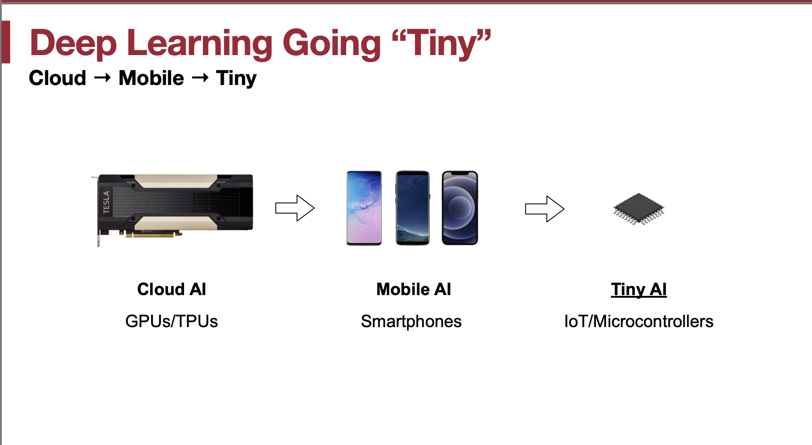
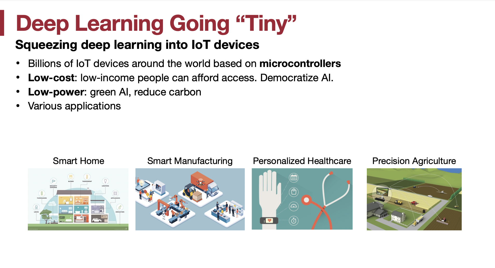
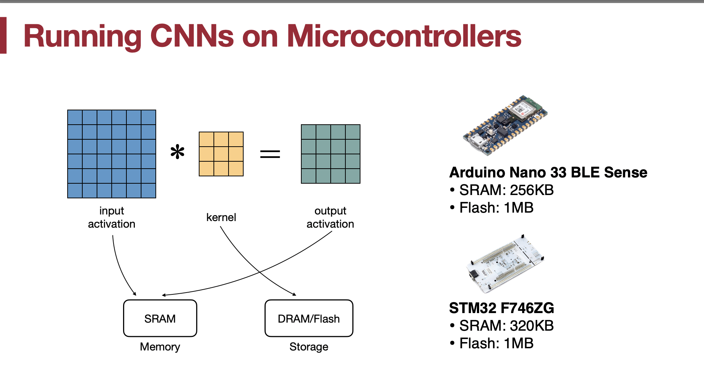
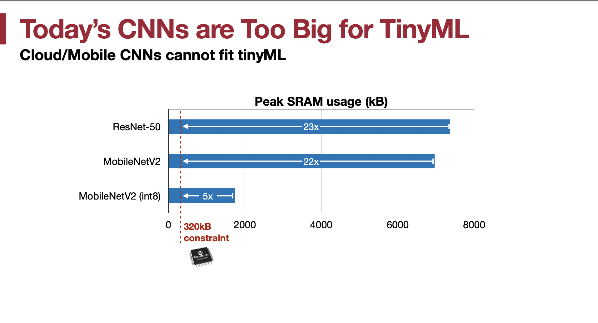
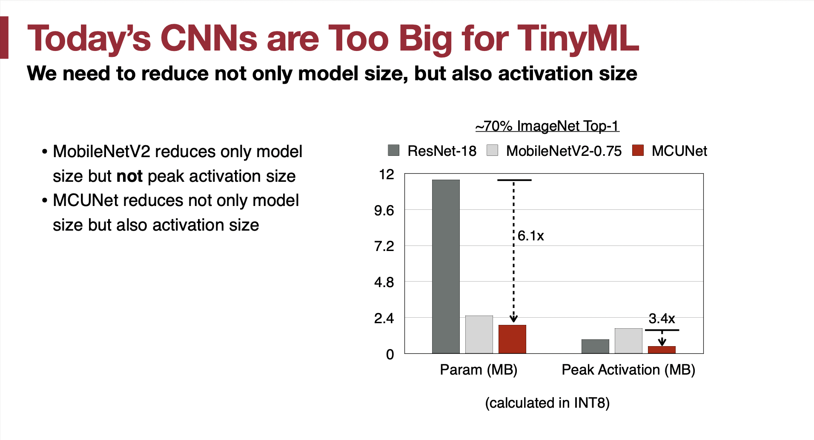
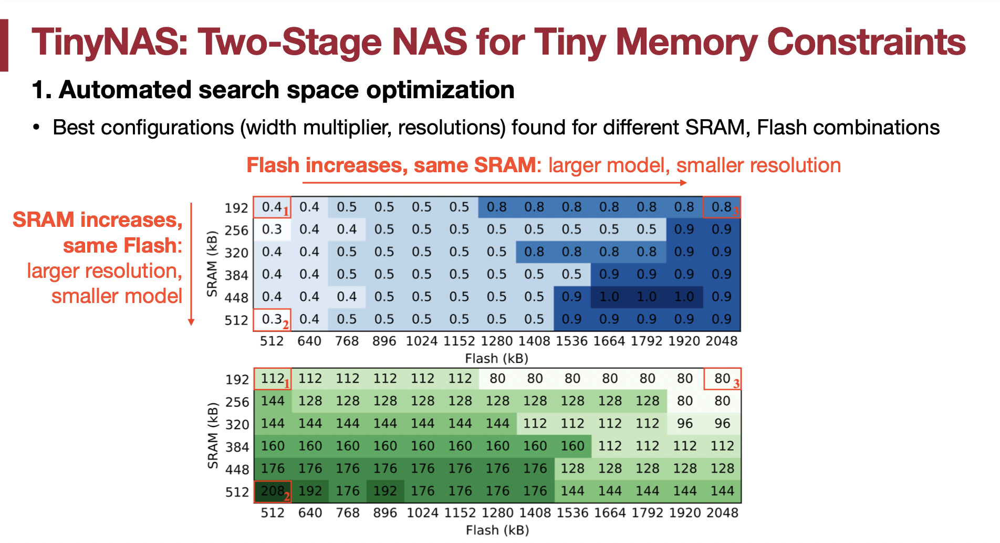
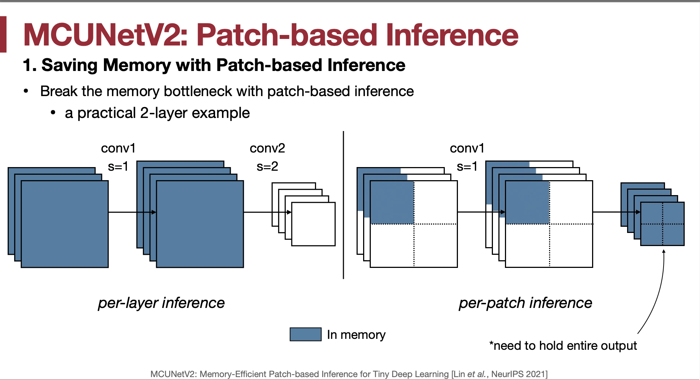
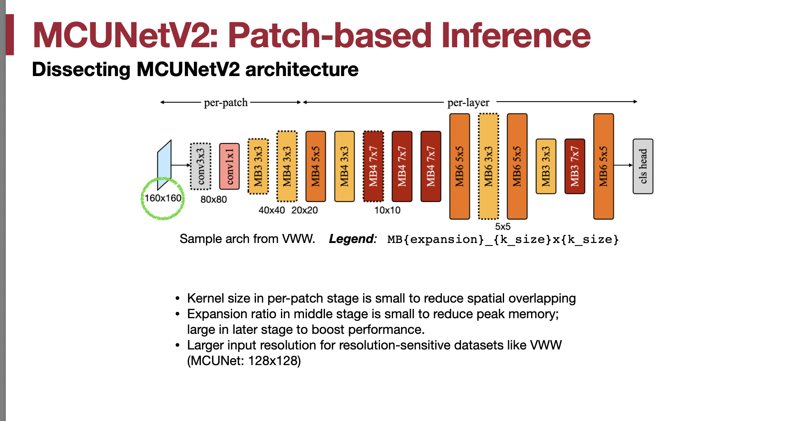
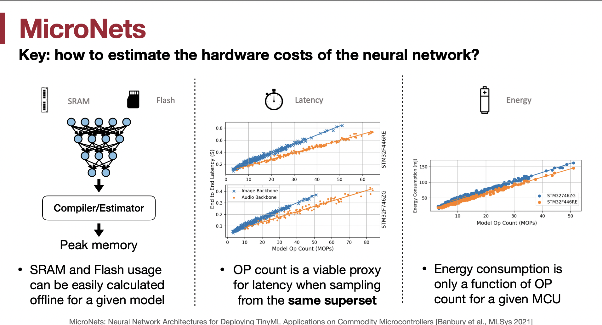

# Lecture 11: MCUNet - Tiny Neural Network Design for 

## Note Information

| Title       | MCUNet - Tiny Neural Network Design for Microcontrollers                                               |
| ----------- | ------------------------------------------------------------------------------------------------------ |
| Lecturer    | Song Han                                                                                               |
| Date        | 10/18/2022                                                                                             |
| Note Author | Ian Lee (ianl)                                                                                         |
| Description | Introduces MCUNet, challenges, designs, and applications.                                              |

### Lecture overview
1. TinyML and motivation
2. Challenges of TinyML
3. Designing TinyML
4. TinyML applications

### 1. Why TinyML
* Today's AI is too big, with parameter size exceeding billions.
* As a general trend, we want deep learning tools that require lower resources (cost, energy, size) and have better privacy.
 

* Today, the majority of IoT devices are based on micrcontrollers, these IoT devices are:
    * low-cost: low income people can afford access = Democratize AI.
    * Low-power: green AI because it is so small = reduce carbon.
    * And ubiquitous = everywhere.
* Therefore, we have a need to "sqeeze" deep learning into these devices to reach our original goals.

* General IoT devices coupled with deep learning have wide range of applications:
    * Smart home monitoring.
    * Automated, smarter manufacturing such as camera-based anomaly detection.
    * Personalized healthcare = measures biomarkers and health statistics.
    * Precision agriculture.

 

### 2. Challenges of TinyML
 
* Squeezing large deep learning models onto smaller platforms are difficult:
    * The available memory is to small to hold deep neural networks (DNN)
    * for example, Cloud AI is 100K larger than tinyML
    * Achieving this storage reduction is challenging.
    * Other constraints
        * Latency constraint
        * Energy constraint
        * Memory constraint
    * **We need to reduce both weights and activation to fit DNNs for tinyML**

## Running CNNs on Microcontrollers
 
  * For a CNN, we need to use/store input activation, kernel, and output activation.
    * Kernel is same throughout the training cycle, so we can place it in read-only storage, so we place it at static DRAM/Flash storage
    * Other activations depend on the image, so we place it at SPAM (dynamics)
    * For reference,
        * Adruino Nano 33 BLE Sense
            * SPAM: 256KB (magnitude of KBs)
            * Flash: 1MB
        * STM32 F746ZG
            * SPAM: 320KB
            * Flash: 1MB
    * For Flash Usage
        * Static, need to hold the entire model (non-volatile, can keep the same across inferences)
    * SRAM Usage (dynamic)
        * In general, = input activation + output activation 
        * Dynamic, different for each layer
        * We care about peak SRAM (we are not doing propagation), peak is the bottleneck.
        * Weights are not counted since they can be partially fetched
    * When we are running neural network on computers
        * We use DRAM, but in microcontroller, we don’t have that luxury (only Flash).

    * **Question**: Why don't we just buy a DRAM and combine it with the microcontroller?
    * **Answer**: Microcontroller is only a single chip, SRAM is on the chip, DRAM is on a separate one. Fusing DRAM to microcontroller chip = higher cost = no longer cost effective and small.

* # Peak SRAM usage
 
 * We need to reduce not only number of parameters, but also peak activation size.
 * Comparing MobileNetV2 and MCUNet, MCUNet reduces not only model size but also activation size.

 

### 3. Designing TinyML
* # System-Algorithm Co-design
 
  * MCUNet has efficient neural architecture, achieved through NAS, and efficient runtime, achieved through TinyEngine (cover in later lecture).

* For TinyNAS, we need to find the search space smartly to have good performance.
  * We cannot reuse other carefully-crafed search space for tinyML because they are too big!
  * So, we first design the design space, then search the subnetwork.
  * In tinyNAS, we have a 2-stage NAS given memory limit:
    1. Automate search space optimization by analyzing FLOP distribution.
        * In general, larger FLOPs -> Larger model capacity -> More likely to give higher accuracy
        * We then find the best configuration (width multiplier, resolutions) for different
        SRAM/Flash setup.
    2. After designing the search space, we perform resource-constrained model specialization
        * We do this by getting random sampled sub-networks
        * Then, we jointly finetune multiple sub-networks to produce a super network.

 

* # MCUNetV2: Patch-based inference

  * Memory distribution should ideally be balanced, but in MobileNetV2, the peak SRAM usage is much higher than most layers' usage, leading to a skewed distribution. [[MCUNetV2: Memory-Efficient Patch-based Inference for Tiny Deep Learning [Lin et al., NeurIPS 2021]](https://arxiv.org/abs/2110.15352)
  * We reduce the overall memory use with patch-based inference and other techniques.

  1. Use patch-based inference
  
    * Saving memory with patch-based inference
        * Break the memory bottleneck with patch-based inference
        * Before, we use per layer, now, we select patch per layer to perform inference
    * Using this technique, we successfully alleviate the peak SRAM demand issue.
    * Issue with patch-based inference
        * For example, halo effect can lead to repeated computation, this is when spatial overlapping gets larger as the receptive field grows, which results in larger computation overhead.
   2. We can also leverage network redistribution to reduce overhead
        * 

   3. Joint Automated Search for Optimization

* # Applications of MCUNetV2
    * Visual wake words under 32KB memory = using camera to tell if there is people present and turn on/off appliances accordingly
    * Results: higher accuracy, 4x lower SRAM

* # Composition of MCUNetV2
    * 
    * Dissecting MCUNetV2
        * Kernel; size in per-patch stage is small
        * Expansion ratio in middle stage is small due to reduced peak memory
        * Later, in the inverted bottleneck layer, we can use larger expansion ratio to boost performance
    * RNNPool = non-linear pooling for RAM constrained inference
        * We replace a sequence of blocks with RNNPool = no longer have memory bottleneck
        * Interesting idea of replacing convolutional blocks with RNN blocks

* Estimating hardware cost of a neural network
    * 
    * Peak memory can be calculated by measuring SRAM/Flash usage
    * We can use OP count to estimate latency.
    * And, to estimate energy, we can also rely on the OP count since there is a relationship between energy and OP count.
    * [[MicroNets: Neural Network Architectures for Deploying TinyML Applications on Commodity Microcontrollers [Banbury et al., MLSys 2021]]](https://arxiv.org/abs/2010.11267)

### 4. TinyML applications
1. Tiny Vision
    1. Detect person in room
    2. Face/mask detection
    3. Tiny on-device training
2. Tiny Audio
    1. Keyword spotting
3. Tiny time series / anomaly detection
    1. Video surveilance
    2. Healthcare
    3. Prevent fraud, adversary attacks
    4. Mostly vision-based, but there are time-series, temperature/weather-data data also available for this application.
    5. Autoencoder = basically encode the distribution of the normal data, and check if the input data is out of the distribution as a way to gauge if the input is anomaly
    6. Hardware constraints: SRAM 256 KB, Flash 1 MB, CPU = cortex
    7. common anaomaly detection approach
        1. K-means
        2. Autoencoders
        3. GMMs