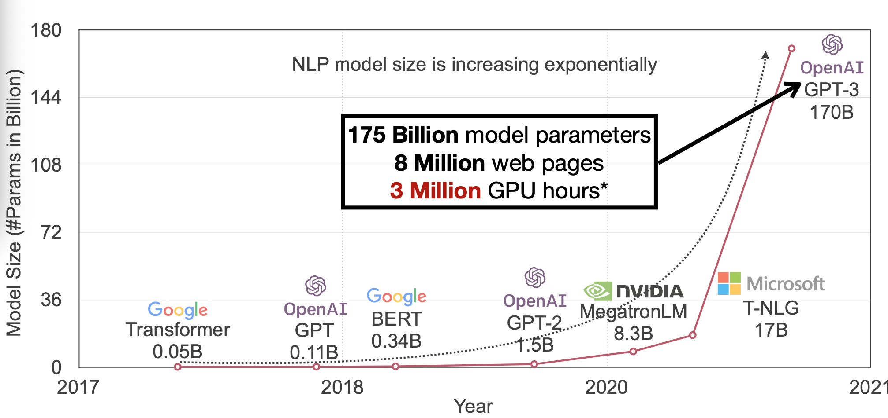
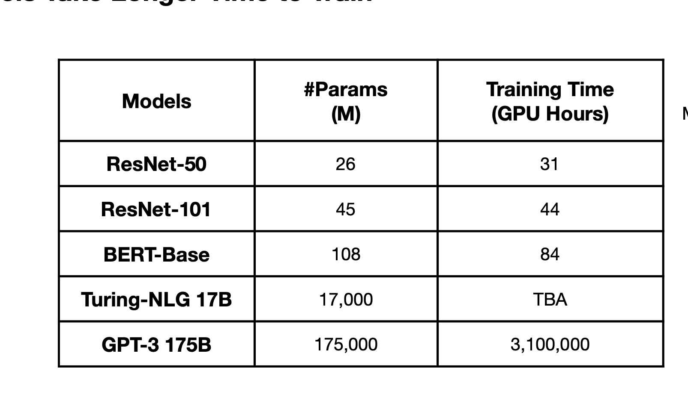
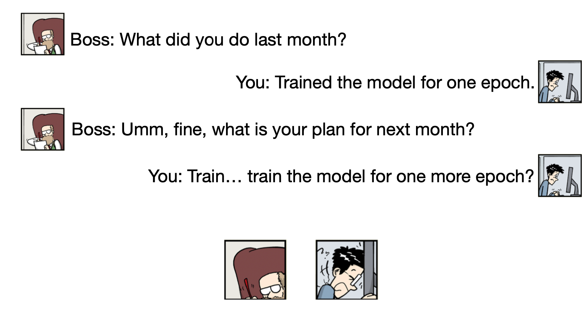
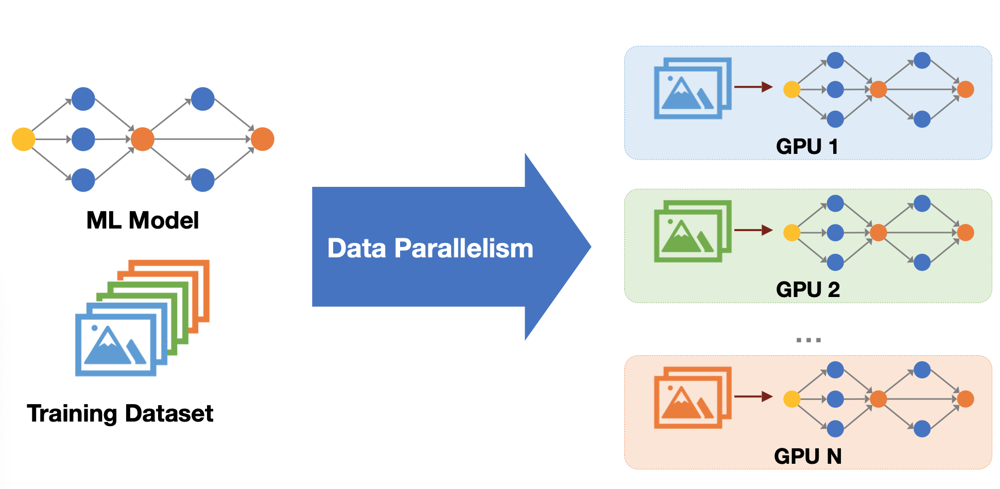
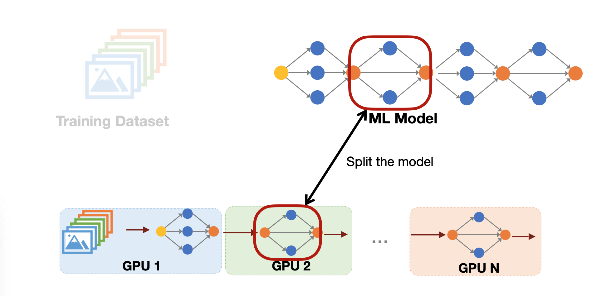
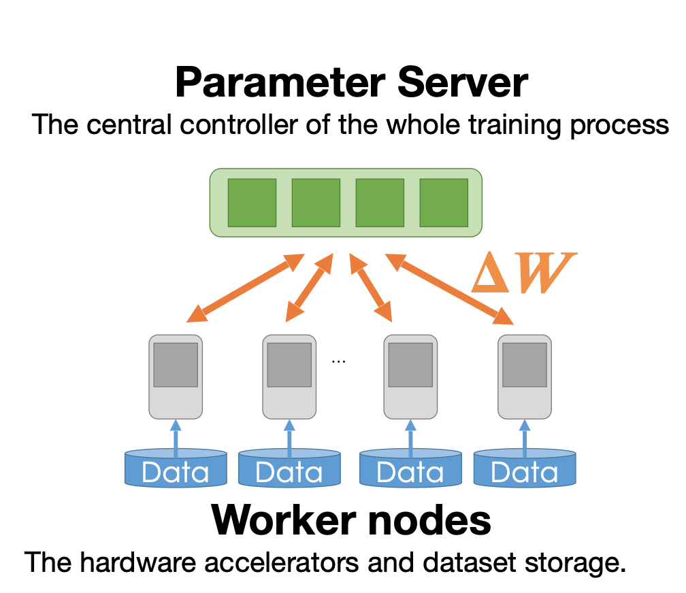
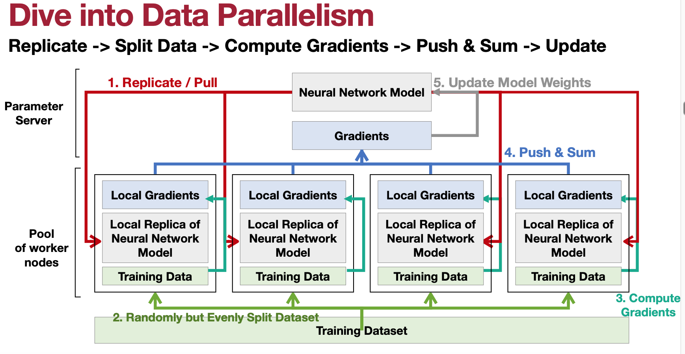

# Lecture 13: Distributed Training and Gradient Compression (Part I)

## Note Information

| Title       | Distributed Training and Gradient Compression (Part I)                                               |
| ----------- | ------------------------------------------------------------------------------------------------------ |
| Lecturer    | Song Han                                                                                               |
| Date        | 10/25/2022                                                                                             |
| Note Author | Mark Jabbour (mjabbour)                                                                                         |
| Description | Introduces approaches to distribute the workload of training ML models accross different machines, and the trade-offs between them. 

## Lecture overview
1. Motivation for distributed training
2. Data and Model Parallelism
3. Data parallelism in depth
4. Distributed Communication Primitives
5. Model Parallelism in depth
6. Beyond model parallelism

### 1. Motivation for distributed training

The most accurate machine learning models have become increasingly large. Making the models much slower to evaluate, and much harder to train. This has led to increased interest in effecient machine learning. While techniques like quantization and pruning help reduce the inference time, most of them are not as effective for training. Furthermore, models that contains tens of billions of parameters would not fit in a single GPU even if quantized.

For example, GPT-3 contains 175 Billion parameters. Even if they were each 8-bit quantized, this would amount to 1.7 TB, which is more than what most accelerators can fit in memory.

 

Clearly, the increase in size makes training a bottle-neck for machine learning professionals. As illustrated by the following table of estimates for the training time of different models on single NVIDEA A100 GPU:

 

### 2. Data and Model Parallelism

To allow researches to iterate on designs of large models in a reasonable fashion, the industry turned into distributed training. A recent example of this at MIT is the training of the vision model in  [[Lin *et al.*, 2019]](https://arxiv.org/pdf/1811.08383.pdf), where researches distributed the work on 256 SUMMIT Nodes to reduce the training time from 49h 50min to 14min.

There are two general flavors of parallelism we can exploit to distribute training. Data parallelism, and model parallelism.

#### Data Parallelism

Data Parallelism is when every node has a local copy of the model parameters, and is responsible for training on a subset of the data set. The different GPUs need to periodically synchronize to keep their local copies in tune, as we will discuss later. A high level view of Data Parallelism is illustrated in the image below [[Jia *et al.*, 2022]](https://www.cs.cmu.edu/~zhihaoj2/15-849/):

#### Model Parallelism

Model Parallelism is when every node is responsible for the forward and back propagations steps of a few layers in the model. A high level view of Data Parallelism is illustrated in the image below [[Jia *et al.*, 2022]](https://www.cs.cmu.edu/~zhihaoj2/15-849/):

#### Trade-offs

We will dive deeper into the details of each. However, on a high level we can observe the following:

|Data Parallelism |Model Parallelism|
|----------|----------|
|Splits the data |splits the model |
|same model accross devices  |Move activations between devices      |
|Easy to exploit, high utilization  |Hard to exploit, load balancing issues      |
|N copies of the model  |one copy of the model      |
|Model is bounded by a node's memory  |Layer is bounded by a node's memory      |

### 3. Data parallelism in depth

To better understand data parallelism we explore a simplified version of [[Mu Li et al. 2014]](https://web.eecs.umich.edu/~mosharaf/Readings/Parameter-Server.pdf). In our system, nodes take on one of two roles:

1. **Parameter Server:** Responsible of synchronizing local copies by receiving local gradients, aggregating them, and pushing the aggregate to workers
2. **Workers:** Responsible for computing a gradient based on their part of the dataset (and local portion of the dataset). 

The workers run the procedure as follows:

For iteration i in 0..T,
1. Replicate / Pull gradients from parameter server
2. Get a random subset of the data
3. Compute a gradient based on the subset
4. Send the gradients to the parameter server, and wait for it to aggregate other gradients
5. Receive the aggregate gradient, and update the parameters accordingly

Notice that this looks almost identical to what training on what device looks like, except for steps 1 and 4. The process is summarized with the following diagram from [[Lin et al. 2018]](https://openreview.net/pdf?id=SkhQHMW0W).

### 4. Distributed Communication Primitives

### 5. Model Parallelism in depth

### 6. Beyond model parallelism

