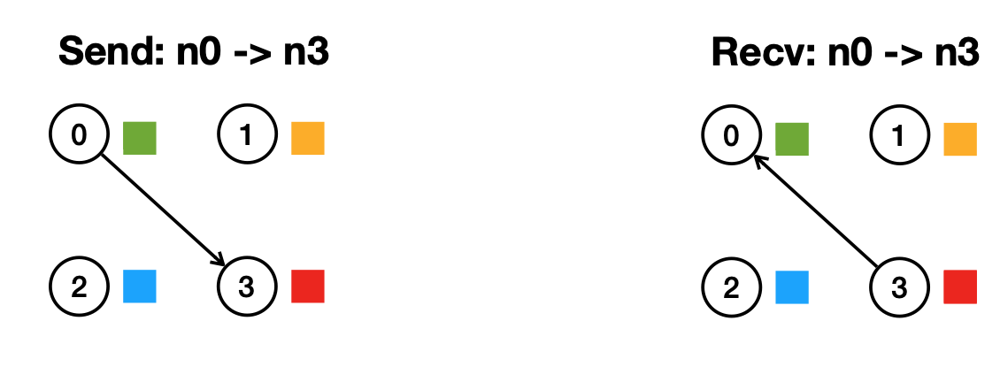
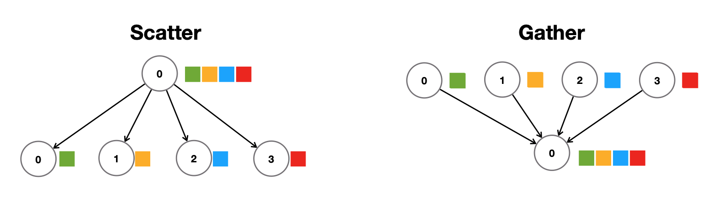
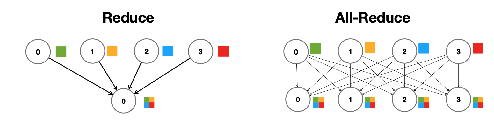
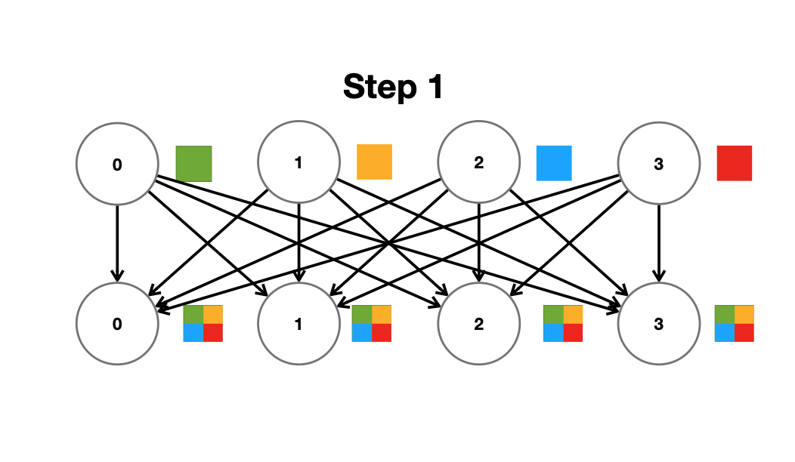
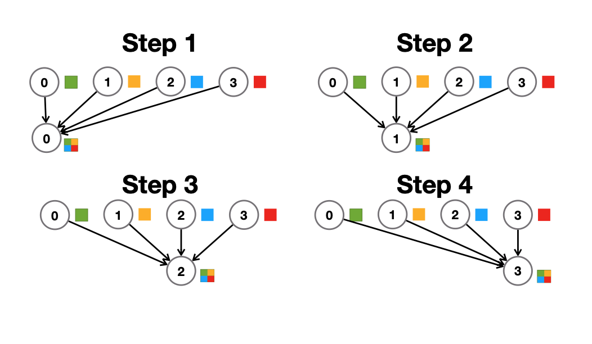
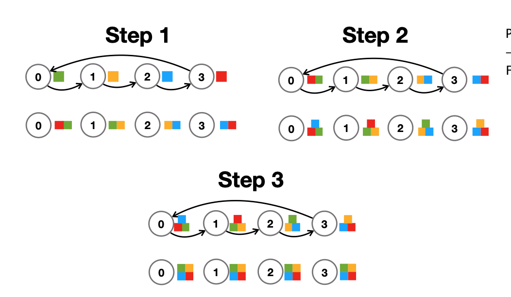
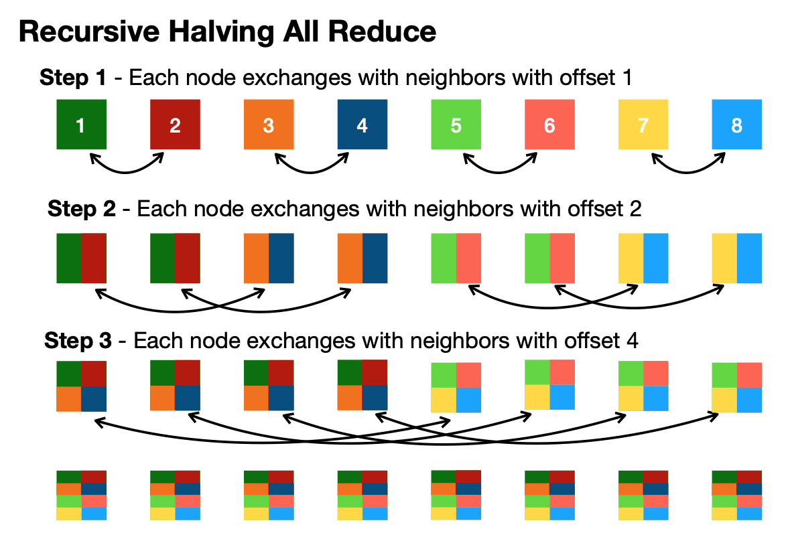
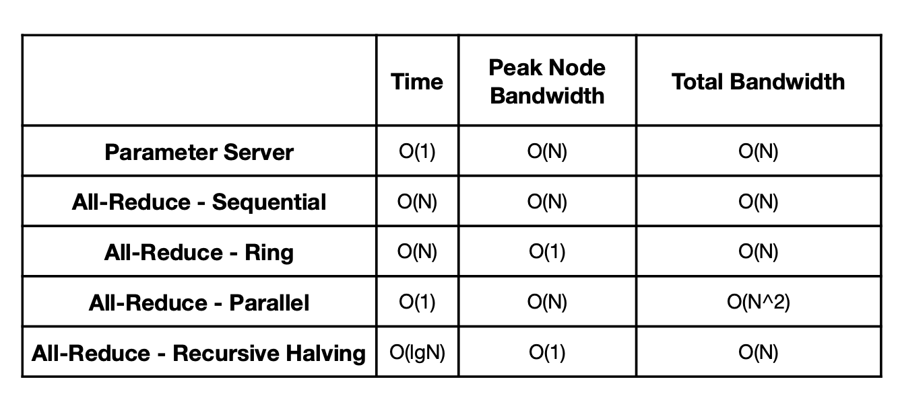

# Lecture 13: Distributed Training and Gradient Compression (Part I)

## Note Information

| Title       | Distributed Training and Gradient Compression (Part I)                                               |
| ----------- | ------------------------------------------------------------------------------------------------------ |
| Lecturer    | Song Han                                                                                               |
| Date        | 10/25/2022                                                                                             |
| Note Author | Mark Jabbour (mjabbour)                                                                                         |
| Description | Introduces approaches to distribute the workload of training ML models accross different machines, and the trade-offs between them. 

## Lecture overview
1. Motivation for distributed training
2. Data and Model Parallelism
3. Data parallelism in depth
4. Distributed Communication Primitives
5. Model Parallelism in depth
6. Beyond model parallelism

### 1. Motivation for distributed training

The most accurate machine learning models have become increasingly large. Making the models much slower to evaluate, and much harder to train. This has led to increased interest in effecient machine learning. While techniques like quantization and pruning help reduce the inference time, most of them are not as effective for training. Furthermore, models that contains tens of billions of parameters would not fit in a single GPU even if quantized.

For example, GPT-3 contains 175 Billion parameters. Even if they were each 8-bit quantized, this would amount to 1.7 TB, which is more than what most accelerators can fit in memory.

 

Clearly, the increase in size makes training a bottle-neck for machine learning professionals. As illustrated by the following table of estimates for the training time of different models on single NVIDEA A100 GPU:

 

### 2. Data and Model Parallelism

To allow researches to iterate on designs of large models in a reasonable fashion, the industry turned into distributed training. A recent example of this at MIT is the training of the vision model in  [[Lin *et al.*, 2019]](https://arxiv.org/pdf/1811.08383.pdf), where researches distributed the work on 256 SUMMIT Nodes to reduce the training time from 49h 50min to 14min.

There are two general flavors of parallelism we can exploit to distribute training. Data parallelism, and model parallelism.

#### Data Parallelism

Data Parallelism is when every node has a local copy of the model parameters, and is responsible for training on a subset of the data set. The different GPUs need to periodically synchronize to keep their local copies in tune, as we will discuss later. A high level view of Data Parallelism is illustrated in the image below [[Jia *et al.*, 2022]](https://www.cs.cmu.edu/~zhihaoj2/15-849/):

#### Model Parallelism

Model Parallelism is when every node is responsible for the forward and back propagations steps of a few layers in the model. A high level view of Data Parallelism is illustrated in the image below [[Jia *et al.*, 2022]](https://www.cs.cmu.edu/~zhihaoj2/15-849/):

#### Trade-offs

We will dive deeper into the details of each. However, on a high level we can observe the following:

|Data Parallelism |Model Parallelism|
|----------|----------|
|Splits the data |splits the model |
|same model accross devices  |Move activations between devices      |
|Easy to exploit, high utilization  |Hard to exploit, load balancing issues      |
|N copies of the model  |one copy of the model      |
|Model is bounded by a node's memory  |Layer is bounded by a node's memory      |

### 3. Data parallelism in depth

To better understand data parallelism we explore a simplified version of [[Mu Li et al. 2014]](https://web.eecs.umich.edu/~mosharaf/Readings/Parameter-Server.pdf). In our system, nodes take on one of two roles:

1. **Parameter Server:** Responsible of synchronizing local copies by receiving local gradients, aggregating them, and pushing the aggregate to workers
2. **Workers:** Responsible for computing a gradient based on their part of the dataset (and local portion of the dataset). 

The workers run the procedure as follows:

For iteration i in 0..T,
1. Replicate / Pull gradients from parameter server
2. Get a random subset of the data
3. Compute a gradient based on the subset
4. Send the gradients to the parameter server, and wait for it to aggregate other gradients
5. Receive the aggregate gradient, and update the parameters accordingly

Notice that this looks almost identical to what training on what device looks like, except for steps 1 and 4. The process is summarized with the following diagram from [[Lin et al. 2018]](https://openreview.net/pdf?id=SkhQHMW0W).

One issue with the architecture above, is that *it is limited by the bandwidth of the paramater server* .  For example, i we train ResNet50 on 256 nodes, with the goal of achieving 3 iterations per second. Note that if we assume 32 bit precision for the gradient, then it's size based on the number of parameters would be 97.5MB. Then we would require $256 \times 3 \times 97.5 = 73.1 GB/s$. This is an unreasonably large bandwidth. When even some of the most cutting edge adapters like Mellanox ininitteband connectx-5 are limited 12.5GB. In the following section we look for ways to get rid of the parameter server to resolve the issue.

### 4. Distributed Communication Primitives

#### Networking Primitives

We start by looking into various known networking primitives:

1. **Point to point and send and Recv:** These are the fundemental building blocks for other primitive, and all implemented in Socket / MPI / Gloo / NCCL.

2. **Scatter and Gather:** send a tensor to every other node in the network, or receive one from each other node.

3. **Reduce and All-Reduce:** Reduce is the same as gather, but computes a (usually commutative and assosciative) aggregate on the data. Reduce all produces the same result as running reduce on each node.

#### Networking primitives and our Data Parallelism system

Note that our systems requires network operations in two steps:
1. *step 1* Replicate and Pull. This is effectively a **broadcast** operation from the server. 
2. *step 4* Push and Sum: THis is essentially a **gather** operation

These operations if implemented naively require $O(n)$ bandwidth from the parameter server, and $O(1)$ from workers. How can we replace the parameter server? If we think about the end result of these two steps, we notice that it is equivelant to a **reduce-all** operation, where we sum the gradients.

#### All-Reduce mechanisms

Now that we have established why reduce-all is important for us, we study different ways to implement it:

1. **Naive Parallel All Reduce:** Every node sends it's tensor to every other node. Sum is computed locally. Bandwidth is $O(N^2)$, time is $O(1)$

2. **Naive Sequential All Reduce:** Same as above, but we broadcase from each node in $N$ stepss. (Each node broadcasts in a different step). Bandwidth $O(N)$, time is $O(N)$

3. **Ring All Reduce:** Nodes are ordered in a ring, in the first step each node sends its tensor to the next one. In all other steps, each node sends the tensor it received in the previous step to the one after it. Sums are computed locally. Badnwidth is $O(N)$, time is $O(N)$

4. **Recursive halving all reduce:** This works in a way similar to the recursion in merege sort In Step $i$ (starting from step $0$). We break our nodes into chunks if size $2^{i}$, pair up nodes nodes consecutives chunks. Each such pair send the other the current sum, and add the value they received to the current sum.  Badnwidth is $O(N)$, time is $O(\log n)$

#### Summary

### 5. Model Parallelism in depth

### 6. Beyond model parallelism

