# Lecture 14: Distributed Training and Gradient Compression (Part II)

## Note Information

| Title       | Distributed Training and Gradient Compression (Part II)                                                                            |
|-------------|-----------------------------------------------------------------------------------------------------------------|
| Lecturer    | Song Han                                                                                                        |
| Date        | 10/27/2022                                                                                                      |
| Note Author | Emelie Eldracher (emelieel)                                                                                      |
| Description | Further investigate distributed training | overcome bandwidth and latency bottleneks

## 1. Problems of Distributed Training

* (1) Requires Synchronization, High Communication Frequency
* (2) Larger Model, Larger Transfer Data Size, Longer Transfer Time
* (3) More Training Nodes, More Communication Steps, Longer Latency
* (4) Poor Network Bandwidth & Intermittent Connection for Cellular Networ

### (1) Requires Synchronization, High Communication Frequency

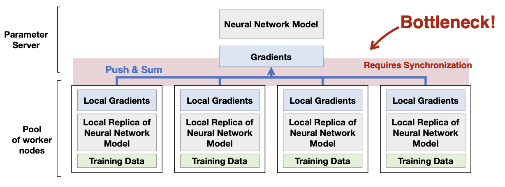

As we push and sum local gradients to the server gradients, we create a bottleneck. The synchronization required to update gradients efficiently and correctly at high volume leads to challenges. 

### (2) Larger Model, Larger Transfer Data Size, Longer Transfer Time

A normal ethernet cable that we plug in has a bandwidth of <strong>1Gb/s</strong>. Larger models like Swin-Large possess a bandwidth over 3x that amount. As we increase the size of the model we're training, we have more gradients we need to communicate on our bandwidth.

### (3) More Training Nodes, More Communication Steps, Longer Latency

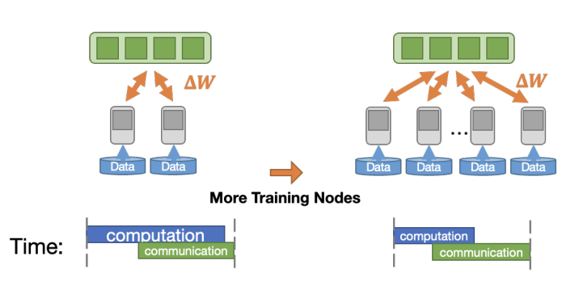

Training using more worker nodes means there's a larger overhead in communication (i.e. more worker nodes == longer latency == more communication time needed). Even though we've lowered computation latency, that massive increase in communication takes a hit on speed. 

### (4) Poor Network Bandwidth & Intermittent Connection for Cellular Networ

In order to communicate and update gradients, we need network connection. When that gets spotty, the high freqency communication can't properly go through. We potentially lose computation in this connectivity bottleneck. 

## 2. Gradient Compression: Reduce the Gradient Size

* (1) Gradient Pruning
* (2) Gradient Quantization

### (1) Gradient Pruning: Sparse Communication

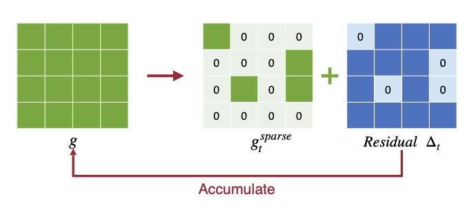

One way to cut down on communication time is to only send the gradients that have the highest impact. This means only transfering gradients with top-k magnitude. In this solution, we keep the un-pruned part as error feedback (residual) for local gradients. We accumulate pruned gradients in local buffers. Overall, training speed will increase with sparse communication but only for simple neural nets. We will have a relatively low sparsity ratio. Once we build bigger modern models,like ResNet, we face poor performance through dropping accuracy. This occurs due to <strong>momentum</strong>. 

### (1) Gradient Pruning: Deep Gradient Compression

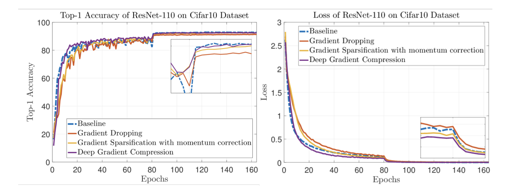

<strong>momentum</strong>. 

• Momentum is an extension to gradient descent that better allows us to overcome local minima and the oscillation of noisy gradients. It is widely used to train modern DNNs (used in AlexNet, VGG, ResNet, Transformer, BERT …).

<strong>how does momentum work? </strong>. 

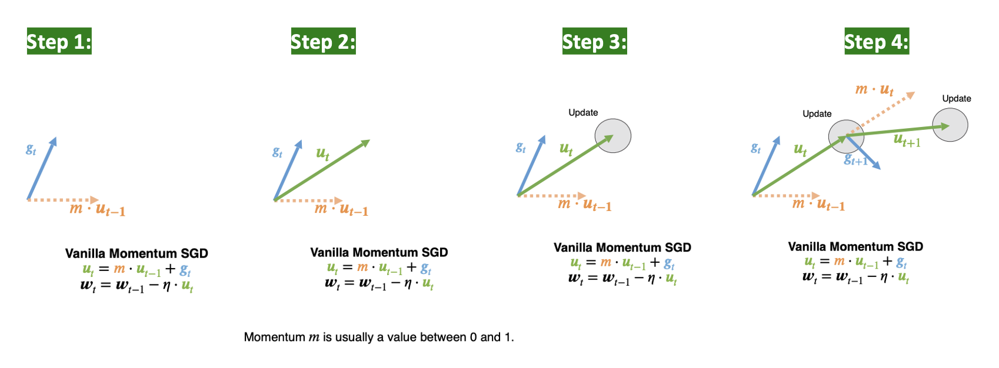

Step 1: obtain the gradient
Step 2: calculate the velocity using momentum
Step 3: Update model weights using velocity 
Step 4: Repeat. Calculate the velocity for the next iteration. Update weights. 

We use the local buffers of the accumulated pruned gradients in sparse communication to calculate momentum for Deep Gradient Compression. We must correct the momentrum to better understand the direction of the actual velocity. If we simply accumulated the gradients, we would no longer match the direction of the true velocity. 

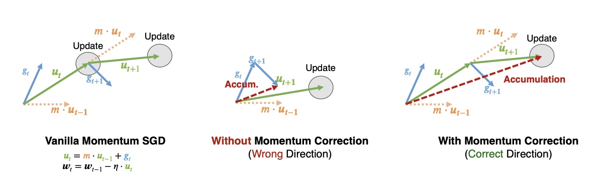

Step 1: Start from gradients and momentum
Step 2: Accumulate the velocity through iterations

Accumulate the velocity through iterations. By accumulating the velocity, the optimization status now matches vanilla momentum SGD.

<strong> Warm Up </strong>. 

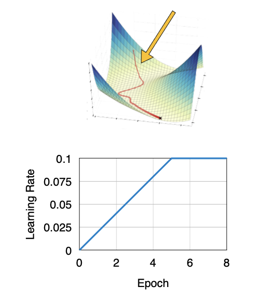 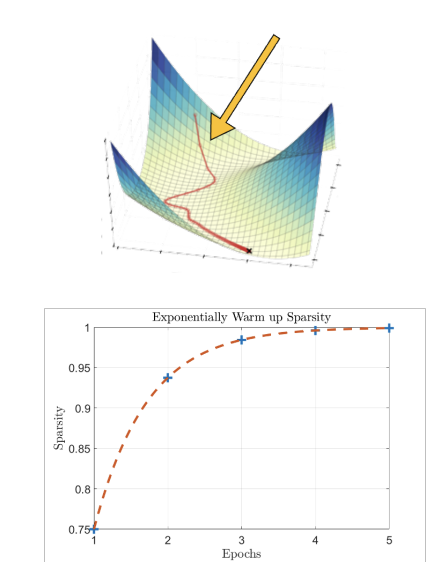 

The NN changes rapidly in early stages of training. Local gradient accumulation and stale gradients exacerbate the isssue. However, by using some warmup tricks, we can alleviate the problem [[Lin *et al.*, 2017]](https://arxiv.org/abs/1712.01887):

Warm up trick 1: Warm up the learning rate 
Warm up trick 2: Warm up sparsity by exponentially increasing sparsity in the first several epochs. This helps the optimizer to adapt to larger sparsity.

Compared to Gradient Sparsification, we will have a higher sparsity ratio (99.9%) while keeping the accuracy.

But we still have a problem: sparse gradients gets denser during all-reduce in Deep Gradient Compression.

### (1) Gradient Pruning: PowerSGD

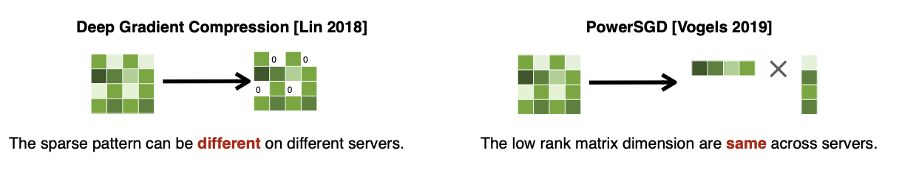 

With PowerSGD, instead of using fine-grained pruning, we adapt low-rank factorization. By doing so, we prevent gradients from getting denser and address gradient compression's irregular sparse pattern. 

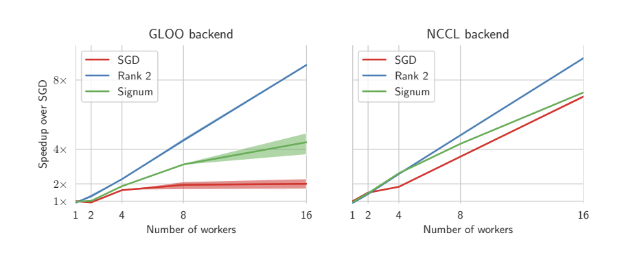 

As we increase the #num workers, we see a direct linear <strong>speedup</strong> in training. PowerSGD reduces the transferred gradient while keeping the <strong>accuracy</strong> at the same level.

As for simplicity, PowerSGD is integrated into pytorch. 

### (2) Gradient Quantization: 1-Bit SGD

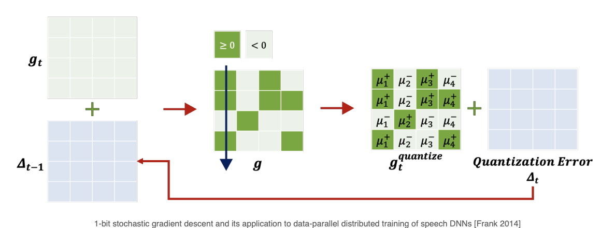 

We perform 1-bit SGD through a column-wise scaling factor and quantization error accumulation [[Frank *et al.*, 2014]](https://www.microsoft.com/en-us/research/wp-content/uploads/2016/02/IS140694.pdf). With one bit, we characterize the sign of the gradient (threshoold of 0: positive versus negative). Once we've done so, we add the column-wise scaling factor (average).

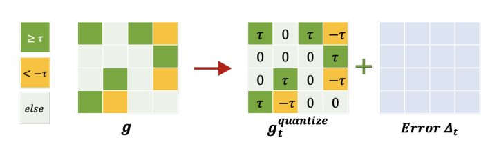 

We could also perform threshold quantization using a value other than 0 [[Nikko, 2015]](https://www.amazon.science/publications/scalable-distributed-dnn-training-using-commodity-gpu-cloud-computing). $\tau$ is used for both the threshold and reconstruction value and is chosen empirically in advance. Similarly to the 1-bit process above, the quantized gradient consists of the three values $\{-\tau, 0, \tau\}$. Once again, we accumulate the quantization error in the local gradient to account for the difference in values. 

### (2) Gradient Quantization: TernGrad

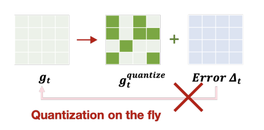 

TernGrad has no quanitization error accumulation [[Dan *et al.*, 2016]](https://arxiv.org/pdf/1610.02132v1.pdf). Instead, by quantizing $\frac{g_i}{\max(\mathbf{g})}$ to $-1, 0, 1$ with probability $\frac{|g_i|}{\max(\mathbf{g})}$, such that $\mathbb{E}[\text{Quantize}(g_i)]=g_i$, we perform qunatization on the fly. 

## 3. Delayed Gradient Update

How can we addresss the latency bottleneck in distributed training? Latency is hard to improve because we have physical limits. We are still sending information accross distance. Traveling from Shanghai to Boston at the speed of light still takes 162ms—it's a physical limit we're attempting to work through. 

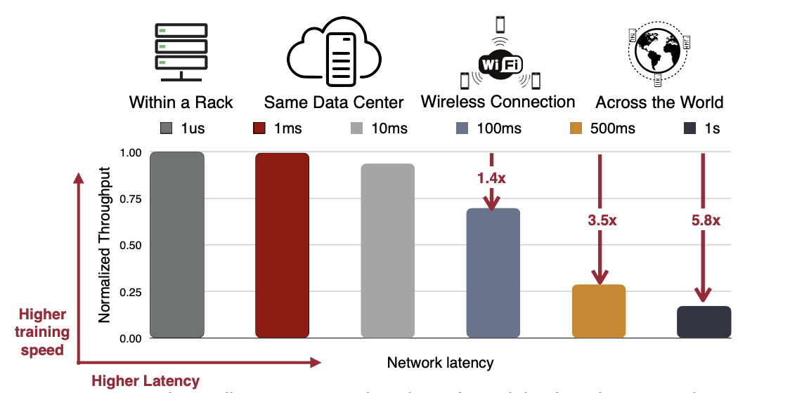 

Ethernet or infinity band connectivity: Bandwidth as high as 100Gb/s, Latency as low as 1us
WiFi or Cellular network connectivity: Bandwidth up to 1Gbp/s, Latency increases to ~200ms

As we see above, data centers with ethernet connectivity have a much higher bandwidth than edge devices that use wifi or cellular to perform distributed training. We can improve bandwidth with hardware upgrades and gradient compression/quantization, but latency is more difficult. The further distance we move training, from within the same rack to accross the world, latency greatly increases as normalized throughput greatly and dramatically decreases.

Conventional Vanilla Distributed Synchronous SGD have poor latency because local updates and communication are performed sequentially. A worker node must wait for the transmission to finish before performing a next step.

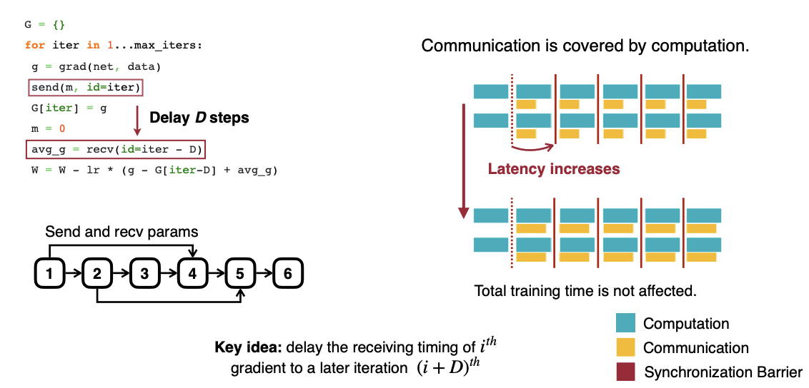

We can address this problem through <strong>Delayed Gradient Averaging</strong> [[Zhu *et al.*, 2021]](https://proceedings.neurips.cc/paper/2021/hash/fc03d48253286a798f5116ec00e99b2b-Abstract.html). Instead of blocking local machines to wait for synchronization finish, workers perform local updates while the parameters are in transmission. By doing this, communication time is covered by computation. Latency won't delay the total training time this way. Overall, Delayed Gradientt Averaging allows stale gradient, it pipelines the communication and computation, and tolerates the latency in distributed training.

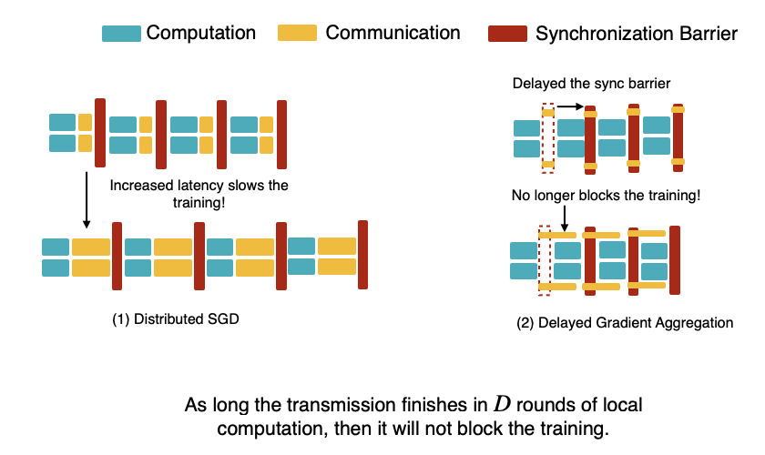

If we directly updates weights, we will hurt the model's performance with stale gradients. However, if we apply gradients with correction terms $w_{(i, j)} = w_{(i, j)} - \eta( \nabla w_{(i, j)} - \nabla w_{(i-D, j)} + \overline{\nabla w_{(i-D)}})$, we will protect the accuracy. With vision and language, we can speed up training by up to 7x. 

