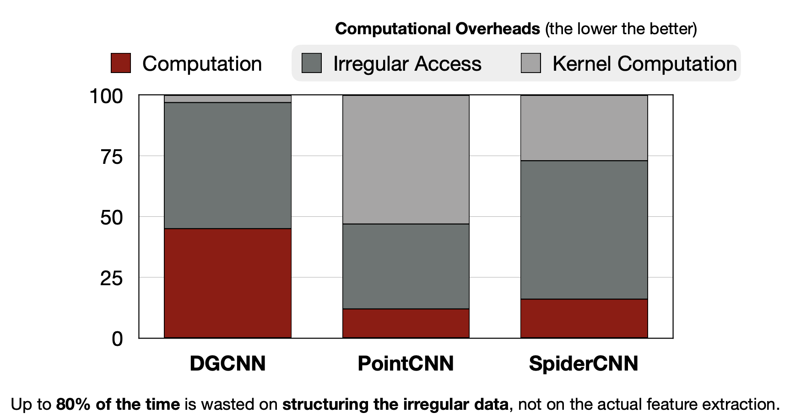
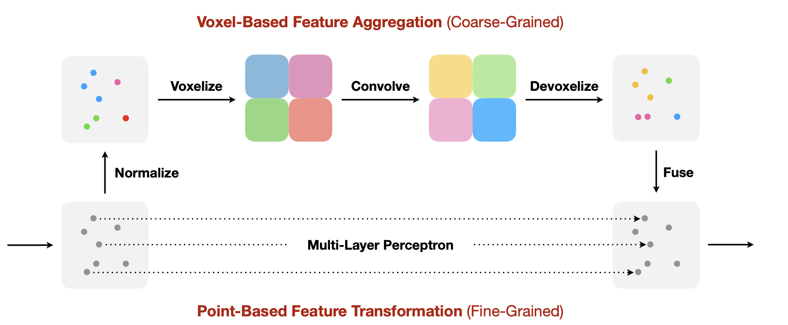

# Lecture 18: Efficient Point Cloud Recognition

## Note Information

| Title       | Efficient Point Cloud Recognition                                                                    |
| ----------- | ------------------------------------------------------------------------------------------------------ |
| Lecturer    | Song Han                                                                                               |
| Date        | 11/10/2022                                                                                             |
| Note Author | Alex Quach (aquach)                                                                                    |
| Description | Intro to Point Clouds, point cloud representations, and system/hardware support for point clouds |

# Point Clouds as an area for optimization 

## Use Case
* Point clouds are collected from LiDAR sensors with accurate distance information
* Point clouds is a collection of 3D points, each with C dimension feature
  * P = {(p, f)}, where p = [x, y, z], f = R^C

Applications:
* Augmented Reality (AR)
* Autonomous Driving
* Particle Discovery (High energy physics)

Challenges in Point Clouds:
* Sparsity
  * Sometimes <0.1% density, requiring irregular storage
  * On the other hand, image data are very dense and regular
* Usually used on resource-constrained devices (on Edge)

# Representations
 Point Cloud Representations

## 1.1 Pseudo / Multi-View Images
### Multi-View Images
* Rendering point cloud as images from different angles
* Then one can use a standard 2D CNN on each rendered image and aggregate results

 Multi-view images of a 3D plane [[Qi et al., CVPR 2016]](https://arxiv.org/pdf/1604.03265.pdf)

### Range Images
* Spherical projection of a continuous 360 point cloud with upper/lower bounds
* Pros: Can use 2D CNNs, whoch is easily deployed
* Cons: Geometric distortion (more difficult on detection, but semantic segmentation works better)

 Projection of a point cloud into a range image [[Wu et al., ICRA 2018]](https://arxiv.org/pdf/1710.07368.pdf) [[Cortinhal et al., arXiv 2020]](https://arxiv.org/pdf/2003.03653.pdf)

### Bird's Eye View (BEV)
* Assumes that there is only one object in the vertical space
* Cartesian projection from 3D scene to 2D x-y plane
  * However, points closer to the sensor have denser representations
* Improvement => Use Polar coordinates to achieve higher resolution
  * Additionally need to use properly padded convolution (0 and 2pi next to each other) (Ring Convolution)

 Bird's Eye View in Cartesian and Polar coordinates [[Zhou et al., CVPR 2020]](https://arxiv.org/pdf/2003.14032.pdf)

## 1.2 Dense Voxels
* Dense Voxels: store all points even if it's empty (H x W x D x C)
* Form of quantization of the point cloud, we can control the size of the voxels and thus the granularity
* Overcoming Overfitting and Rotation
  * Use Subvolume Supervision to predict classification labels from partial voxel feature maps to reduce overfitting
  * Use Orientation Pooling (feeding voxels from different angles) to train rotational invariance. 
* However, memory grows n^3 with voxel resolution

 Tunable voxel resolution during conversion from point cloud [[Nikolov, 2022]](https://towardsdatascience.com/how-to-voxelize-meshes-and-point-clouds-in-python-ca94d403f81d)

## 1.3 Point Set
* Unordered set of points
* PointNet (using just MLP) doesn't model relationship between points [[Qi et al., CVPR 2017]](https://arxiv.org/pdf/1612.00593.pdf)
* PointNet++ uses hierarchy by defining neighborhoods of points using kNN (fixed number of neighbors) or ball query (neightbors that are fixed distance away) [[Qi et al., NeurIPS 2017]](https://arxiv.org/pdf/1706.02413.pdf)
* DGCNN interprets the point cloud as a graph. [[Wang et al., SIGGRAPH 2019]](https://arxiv.org/pdf/1801.07829.pdf)
  * builds the graph in the feature space, instead of the Euclidean
  * does not downsample like PointNet
* PointCNN: Use asymmetric functions to permute neighborhood points into a canonical order, then use 1D conv [[Li et al., NeurIPS 2018]](https://arxiv.org/pdf/1801.07791.pdf)
* PointConv: Introduces dynamic weights acccording to feature differences and point densities [[Wu et al., CVPR 2019]](https://arxiv.org/pdf/1811.07246.pdf)
* KPConv: Interpolation of relationships by starting with a simple 6-point equidistant box and then interpolating from those [[Thomas et al., ICCV 2019]](https://arxiv.org/pdf/1904.08889.pdf)

* However, for all these techniques, much of the time is used to structure the irregular data
* Fast downsampling is a possible solution to balance out as the number of points grows

 Challenges with structuring irregular data [[Liu et al., NeurIPS 2019]](https://arxiv.org/pdf/1907.03739.pdf)

## 1.4 Sparse Voxels
Dense Voxels: store all points even if it's empty (H x W x D x C)

Sparse Voxels: store only points that have something (N x C), where N is number of points

* Using conventional convolution on sparse voxels results in blurry and increasingly large point clouds
* Solution => Sparse Convolutions: only apply convolution on points where the center already has an input
  * Keeps the same sparsity ratio

 Illustration of conventional convolution vs sparse convolution [[Graham, BMVC 2015]](https://arxiv.org/pdf/1706.01307.pdf)

## 1.5 Octree
* Dynamic voxel size depending on the data
* Recursively divides 3D space into fine granularity voxels where there is more information

 Illustration of octree branching [(https://en.wikipedia.org/wiki/Octree)](https://en.wikipedia.org/wiki/Octree)

## 1.6 Hybrid
Point representations are more memory efficient because (dense) voxel requires also storing empty points too

### Point-Voxel CNN (PVCNN) combines both
* Voxel-based branch has better regularity, which is good for neighborhood information 
  * Captures big picture
* Point-based branch can keep high resolution and make up for the information loss in voxelization
  * Captures more fine-grain details

 Voxel- and Point-based branches in Point-Voxel CNN [[Liu et al., NeurIPS 2019]](https://arxiv.org/pdf/1907.03739.pdf)

### Sparse Point-Voxel Convolution (SPVConv)
* (Dense) Voxel representation may be too coarse grained when storing everything
* So we focus on more important parts by using Sparse Voxel representation

 Sparse Voxel improvements over PVCNN use sparse voxelize, convolve, and devoxelize [[Tang et al., ECCV 2020]](https://arxiv.org/pdf/2007.16100.pdf)

### Range-Point Voxel Convolution (RPVConv)
* Adding range images into the mix, so now it's voxel, point, and range image

 Voxel, Point, and Range representations with RPV fusion in SPVConv [[Xu et al., ICCV 2021]](https://arxiv.org/pdf/2103.12978.pdf)

### BEVFusion:
* Fuses Dense image (camera) and Sparse point cloud (LiDAR) branches into the BEV space
* Useful for multiple sensors

 Pipeline of fusing dense images and sparse point clouds in BEV [[Liu et al., arXiv 2022]](https://arxiv.org/pdf/2205.13542.pdf)

Summary of Representations:
* Multi-view images => Lose Information
* Point Set => Irregular access and dynamic kernel
* Dense Voxels => Not Scalable
* Sparse Voxels => high accuracy, scalability, popular, but good system support necessary
* Octree => Difficult to convolve; Not widely used

# System Support
Sparse Convolution
* Requires proper mapping of input, kernel, and output
* TorchSparse
  * uses an output coordinator
  * locality aware access to gather
  * adaptive grouping for matrix multiplication by similar workloads
  * scatter-accumulate for the mapping to ouput
  * Good API uses similar function signature

 Saving computation with TorchSparse by using maps [[Tang et al., MLSys 2022]](https://arxiv.org/pdf/2204.10319.pdf)

* Batching vs Separate Computation is optimized by grouping computation to reduce computation overhead, and have moderate computation regularity

 Balancing overhead and regularity [[Tang et al., MLSys 2022]](https://arxiv.org/pdf/2204.10319.pdf)

* Furthermore can use cacheing to improve performance

# Hardware Support
Using sorting array for Farthest Point sampling, KNN, and Kernel Mapping
* Hardware support of multiple popular techniques with a single sorting array

 Reusing a single sorting hardware component in many mapping operations [[Lin et al., MICRO 2021]](https://arxiv.org/pdf/2110.07600.pdf)
