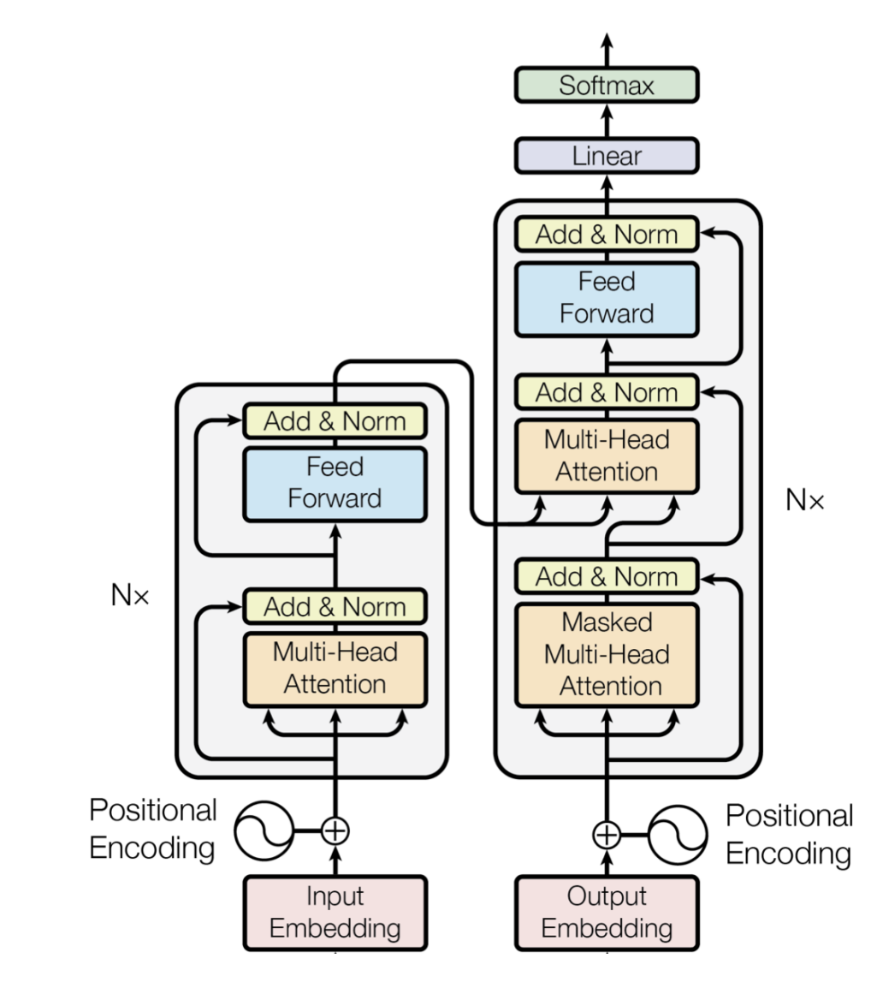
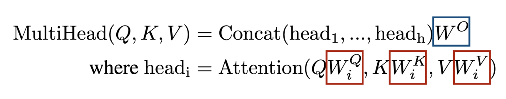
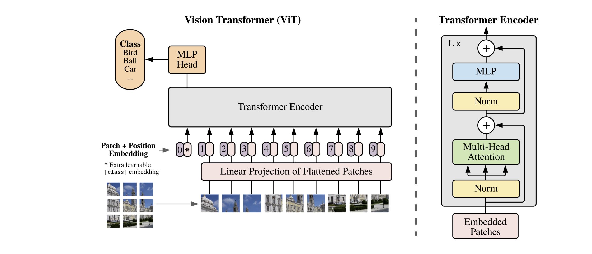
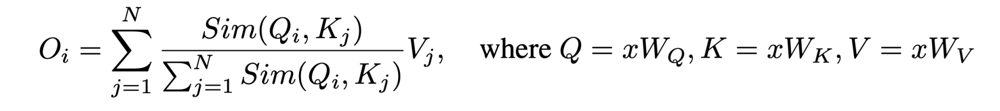
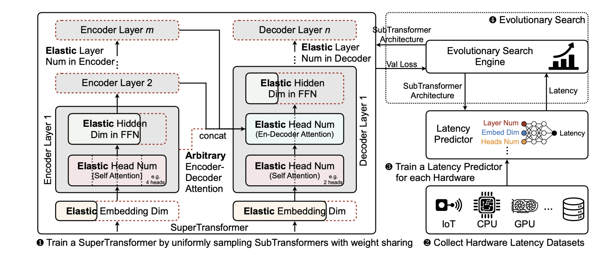
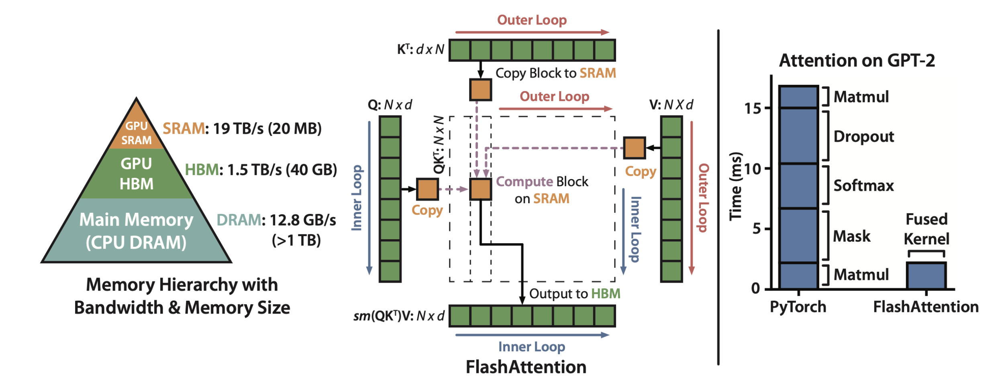

# Lecture 20: Efficient Transformers

## Note Information

| Title       | Efficient Transformers                                                                           |
| ----------- | -------------------------------------------------------------------------------------------------------- |
| Lecturer    | Song Han                                                                                                 |
| Date        | 11/17/2022                                                                                               |
| Note Author | Arman Dave (armdave)                                                                                            |
| Description | Basics and applications of transformers, efficient transformers, and system support for transformers. |

## Outline of this lecture

- basics and applications of transformers

- efficient transformers

- system support for transformers

## Transformer Basics

Biggest use case: Natural Language Processing (NLP)

Two kinds of word representation: one-hot encoding vs word embedding

### One-Hot Encoding

Represent each word as a vector that has as many values as there are words in
the vocabulary. Each column in a vector represents one possible word in a vocabulary.

Con: For very large vocabularies, vectors can get very long and very sparse

## Word Embedding

Map the word index to a continuous word embedding thorugh a look up table - ex: Word2Vec, GloVe

## Pre-Transformer Era

Recurrent Neural Networks

^struggle to retain long-term dependencies (can be solved by LSTM)

Strict dependency across tokens -> limits the scalability

Convolutional Neural Networks

No dependency between tokens, leading to better scalability

Limited context information -> Worse modeling capability

### Transformer overview

- Each encoder block has two sublayers

The first is a multi-head self attention mechanism

The second is a position wise fully connected feed forward newtork

- Each decoder block has an additional third sublayer

The third is a multi head attention over the output of the encoder stack

A residual connection is added around of ehac the two sublayers followed by layer normalization: LayerNorm(x + Sublayer(x))

Decoder generates the output sequence symbols one element at a time in an auto regressive manner

### Multi-Head Self-Attention

Q: query

K: key

V: value

Project Q, K and V with h different, learned linear projections

Perform the scaled dotproduct attention function on each of these projected versions Q, K and V in parallel

Concatenate output values

### FFN

Inverted bottleneck (middle hidden size is larger than input and output size)

### Position Embedding

Unique encoding for each word's position in a sentence

Distance between any two positions is consistent across sentences with different lengths

Deterministic and generalize to longer sentences

### Layer Normalization

Statistics of NLP data across batch dimension exhibit large fluctuation during training

Batch normalization is more efficient since it can be fused into the linear layer

### Language Models

Causal Language model vs masked language model

CLM -> **GPT**

First pre-train a transfomer model on a very large amount of data in a unsupervised manner

Then fine tune this model on much smaller dataset

MLM - **BERT**

Mask some percentage of the input tokens at random

Predict those masked tokens

Next Sentence Prediction

Binarized next sentence prediction task

When choosing the setnences A and B for each pretriang texample: 

50% is the actual next sentence

50% it is a random sentence from the corpus

### Image Transformer: ViT

Split an image into fixed size patches, linearly embed each of them, add position embeddings, and feed resulting sequence of vectors to a transformer

### Video Transformer: ViViT

Extract spatiotemporal tokens, then encode in a *series* of transformer layers

Factorize spatial and temporal dimensions to handle long input sequences

### Audio Transformer: Audio Spectrogram Transformer (AST)

Split 2D audio spectrogram into sequence of 16x16 patches with overlap and then linearly project to sequence of 1d embeddings

### Multimodal Transformer

Linearly project each modality into a feature vector and feed into a Transformer encoder

Transformers are enormous: GPT-3 has 170B parameters!

## Efficient Transformers

### Sparse Attention

#### BlockBERT

*Blockwise Attention*

Chunk input into fixed blocks

Different heads use different masking matrices

Masking matrices can be any permutation

Memory: 18-36% reduction

Training Time: 12-25% reduction

Inference Time: 28% reduction

#### LongFormer

*Global + Local Attention*

Attention with sliding window (analagous to CNNs)

Attention with dilated sliding window (analagous to Dilated CNNs)

Attention with sliding window (analogous to CNNs):
- Fixed-size window attention surrounding each token.

- Complexity is reduced from $O(N^2)$ to $O(N x W)$, where $W$ is the window size.

Attention with dilated sliding window (analogous to dilated CNNs):

- Dilate the sliding window with gaps of size dilation $D$.

- The receptive field is enlarged from $W$ to $W x D$, with the same complexity.

Global attention added on a few pre-selected input locations:

- Classification: The special token ([CLS]), aggregating the whole sequence.

- QA: All question tokens, allowing the model to compare the question with the document.

Global attention is applied symmetrically:

- A token with a global attention attends to all tokens across the sequence, and all tokens in the sequence attend to it.

#### Big Bird

*Random + Local + Global Attention*

Random Sparse Attention

Each query deals with $r$ random number of keys 

Information flows fast between any given pair of nodes

#### Lite Transformer

*Local Convolution + Global Attention*

Long-Short Range Attention (LSRA)

*Convolution* efficiently extracts local features, *Attention* is tailored for global feature extraction

#### Axial Transformer

*Row Attention + Column Attention - for 2D image recognition*

N = Height x width

$O(N^2)$ complexity is prohibitive for 2D images

Factorize attention along different axes

Attention mixes information along a particular axis, while keeping information along other axes independent

Complexity reduced from $O(N^2)$ to $O(H^2 + W^2)$

#### Reformer

*Learned Bucket-wise Attention*

Assume $Q = K$

Then we can group similar vectors into the same bucket using locality-sensitive hashing

Intuition: Attention $Q^TK$ is large only if $Q_i$ and $K_j$ are similar

Locality-Sensitive Hashing: $h(x) = arg_{max}([xR; -xR])$

### Low-Rank Approximations (Linformer)

Assume low-rank structure in NxN matrix -> Improve efficiency by leveraging low rank approximations of the self-attention matrix

Linformer: projects the length dimension (not the feature dimension) of keys and values to a lowerdimensional representation (from N to k)

Complexity is reduced from $O(N^2)$ to $O(NK)$.

### Kernelization - Linear Transformer

Softmax: $Sim(Q, K) = exp(QK^T/sqrt(d))$

Linearized Attention: $Sim(Q, K) = ϕ(Q)ϕ(K)^T$

Complexity reduced from $O(N^2D)$ to $O(ND^2)$

### Quantization - LLM.int8()

*Mixed Precision Decomposition*

Transformers have outlier features that have large values (esp in large models)

Occur in hidden dimensions -> Leads to large quantization error

Solution: Separate outlier features into a separate FP16 MM, while quantizing other values to Int8

### Neural Architecture Search (NAS)

#### Evolved Transformer (ET)

Inputs: Two hidden states

Outputs: New hidden state

Search Space: 

- Encoder has 6 blocks

- Decoder has 8 blocks

Tournament selection evolutionary architecture search

Dynamically allocate resources to more promising architectures

#### Hardware Aware Transformers (HAT)

Problem: FLOPs don't accurately measure real latency

Latency influecing factors of different hardware contrast each other

Hardware latency feedback is necessary to design specialized models for different hardware

### Knowledge Distillation - DistilBERT/TinyBERT

*Feature + Attention Distillation*

Attention Distilattion: Student learns to fit the matrices of multi-head attention in the teacher network

Hidden state distillation: Distill the knowledge from the output of the transformer block

Embedding distillation: $L_{embd} = MSE(E^SW_e, E^T)$

Prediction distillation: $L_{pred} = CE(z^T/t, z^S/t)$

## System Support

### FlashAttention

Use tiling to reduce memory reads/writes between high-bandwidth memory (HBM) and on chip SRAM (which is very expensive)

