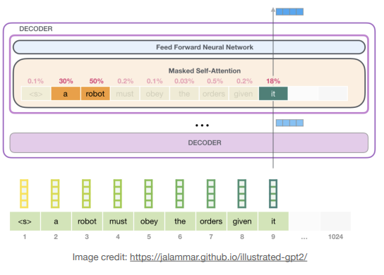

# Lecture 20: MCUNet: Efficient Transformers

## Note Information

| Title       | Efficient Transformers                                                                                          |
|-------------|-----------------------------------------------------------------------------------------------------------------|
| Lecturer    | Song Han                                                                                                        |
| Date        | 11/17/2022                                                                                                      |
| Note Author | Boxiang Wang (boxiangw)                                                                                         |
| Description | Basics and applications of transformers, Efficient transformers, and System support for transformers.           |

## Transformer Basics

It is a neural network architecture that is based on attention mechanism. It is a sequence-to-sequence model that can be used for many NLP tasks. It is also used for computer vision tasks.

### Natural Language Processing

- Word embedding:
  - One-Hot Encoding:
    Representing each word as a vector that has as many values in it as there are words in the vocabulary. Each column in a vector represents one possible word in a vocabulary.
  - Word Embedding:
    Map the word index to a continuous word embedding through a look-up table.
- Pre-Transformer Era:
  - Recurrent Neural Networks (RNNs):
    - The "working memory” struggles to retain long-term dependancies (can be solved by LSTM).
    - There is strict dependency across tokens, limiting the scalability.
  - Convolutional Neural Networks (CNNs):
    - No dependency between tokens, leading to better scalability.
    - Limited context information, resulting in worse modeling capability.
- **Transformer**
  
### Transformer

- Each encoder block has two sub-layers:
  - The first is a **multi-head self-attention** mechanism.
  - The second is a position-wise **fully connected feedforward** network.
- Each decoder block has an additional third sub-layer:
  - The third is a multi-head attention over the output of the encoder stack.
- A residual connection is added around each of the two sub-layers, followed by layer normalization:
  $$LayerNorm(x+Sublayer(x))$$
- The decoder generates the output sequence of symbols one element at a time in an auto-regressive manner.

**Multi-Head Self-Attention (MHSA)**:

- Project Q, K and V with h different, learned linear projections.
- Perform the scaled dot-product attention function on each of these projected versions of Q, K and V in parallel.
- Concatenate the output values.
- Project the output values again, resulting in the final values.

**Feed-Forward Network (FFN)**:

- Each block in our encoder and decoder contains a fully connected feed-forward network, which is applied to each position separately and identically.
- This consists of two linear transformations with a ReLU activation in between.
  $$FFN(x) = max(0,xW_1+b_1)W_2+b_2$$
- The middle hidden size is usually larger than and input and output size (inverted bottleneck).

**Position Embedding (PE)**:

- Positional embedding: Information to each word about its position in the sentence.
  - Unique encoding for each word’s position in a sentence.
  - Distance between any two positions is consistent across sentences with different lengths.
  - Deterministic and generalize to longer sentences.

**Layer Normalization (LN)**:

- The statistics of NLP data across the batch dimension exhibit large fluctuations during training.
- Batch normalization (BN) is more efficient as it can be fused into the linear layer.
- There are some efforts towards using BN in transformers.
  - PowerNorm: Rethinking Batch Normalization in Transformers [Shen et al., 2020]
  - Leveraging Batch Normalization for Vision Transformers [Yao et al., 2021]

### Language Models

**Casual Language Models (CLM) — GPT**:

- System works in two stages:
  - First, pre-train a transformer model on a very large amount of data in an unsupervised manner (language modeling).
  - Then, fine-tune this model on much smaller supervised datasets to solve specific tasks.

**Masked Language Models (MLM) — BERT**:

- Masked language modeling (MLM) is a pre-training task that is similar to CLM, but it is more challenging.
- Task #1: Masked Language Model (MLM) 
  - Mask some percentage (15%) of the input tokens at random.
  - Predict those masked tokens.
- Task #2: Next Sentence Prediction (NSP)
  - Binarized next sentence prediction task.
  - When choosing the sentences A and B for each pre-training example,
    - 50% of the time, B is the actual next sentence that follows A.
    - 50% of the time it is a random sentence from the corpus (NotNext).

## Applications

**Image Transformer — ViT**:

- Vision Transformer (ViT) is a transformer-based model for image classification.
- Split an image into fixed-size patches, linearly embed each of them, add position embeddings, and feed the resulting sequence of vectors to a standard Transformer encoder

**Video Transformer — ViViT**:

- Extract spatiotemporal tokens from the video, then encoded by a series of transformer layers.
- Factorize the spatial- and temporal-dimensions of the input to handle the long sequences.

**Audio Transformer — AST**:

- Split the 2D audio spectrogram a sequence of 16×16 patches with overlap, and then linearly projected to a sequence of 1-D patch embeddings.

**Multi-Modal Transformer — VATT**:

- The VATT model is a multi-modal transformer that can be used for multimodal tasks.
- Linearly project each modality into a feature vector and feed it into a Transformer encoder.

## Efficient Transformers

**Sparse Attention - BlockBERT**: Blockwise Attention

- Key idea: Chunk input into fixed blocks.
  - Different heads use different masking matrices.
  - Masking matrices can be any permutation.
- The complexity is reduced from NxN to NxB.
  - B is the block size (e.g., N/2, N/3).
- Key Results:
  - Memory: 18-36% less
  - Training time: 12-25% less
  - Inference time: 28% less

**Sparse Attention - LongFormer**: Local Attention + Global Attention

- Attention with sliding window (analogous to CNNs):
  - A fixed-size window attention surrounding each token.
  - The complexity is reduced from O(N2) to O(N x W), where W is the window size.
- Attention with dilated sliding window (analogous to dilated CNNs):
  - Dilate the sliding window with gaps of size dilation D.
  - The receptive field is enlarged from W to W x D, with the same complexity.
- Global attention added on a few pre-selected input locations:
  - Classification: The special token ([CLS]), aggregating the whole sequence.
  - QA: All question tokens, allowing the model to compare the question with the document.
- Global attention is applied symmetrically:
  - A token with a global attention attends to all tokens across the sequence, and all tokens in the
sequence attend to it.

**Sparse Attention - Big Bird**: Random Attention + Local Attention + Global Attention

- Random sparse attention:
  - Each query attends over r random number of keys: i.e. A(i, ·) = 1 for r randomly chosen keys.
  - Information can flow fast between any pair of nodes (rapid mixing time for random walks).

**Sparse Attention — Lite Transformer**: Local Convolution + Global Attention

- Long-Short Range Attention (LSRA):
  - Convolution: Efficiently extract the local features
  - Attention: Tailored for global feature extraction.

**Sparse Attention — Axial Transformer**: Row Attention + Column Attention (for 2D Image Recognition)

- The O(N2) complexity is prohibitive for 2D images:
  - N = H W, where H and W are height and width.
- Key idea: Factorize attention along different axes.
  - Each attention mixes information along a particular axis, while keeping information along other axes independent.
  - Analogous to spatially separable convolution:
    - Decompose a 3x3 conv into 1x3 and 3x1 convs.
- The complexity is reduced from O(H2W2) to O(H2 + W2).

**Sparse Attention - Reformer**: 
*Learned Bucket-wise Attention*:

- Assumption: Q (queries) = K (keys)
- Intuition: Attention weight QTK is large only if Qi and Kj are similar.
- Key idea: Group similar vectors into the same bucket (using locality-sensitive hashing).
  
*Locality-Sensitive Hashing (LSH)*:

- Use random rotations of spherically projected points to establish buckets by an argmax over signed axes projections.

**Low-Rank Approximations — Linformer**: Approximate Self-Attention with Low-Rank Matrix

- It projects the length dimension (not the feature dimension) of keys and values to a lowerdimensional representation (from N to k).
- Low-rank method reduces the memory complexity problem of self-attention (from N N to N×k).

**Kernelization — Linear Transformer**:

- Generalized attention can be formulated as
  
- Softmax attention is a special case with
  $$Sim(Q, K) = exp(\frac{QK^T}{\sqrt{d}})$$
- Linearized attention is defined with
  $$Sim(Q, K) = \phi(Q)\phi(K)^T$$
- Complexity is reduced from O(N2D) to O(ND2).

**Quantization — LLM.int8()**: Mixed-Precision Decomposition

- Motivation: Transformers have outlier features that have large values (especially large models)
  - They occur in particular hidden dimensions, leading to large quantization error.
- Key idea: Separate outlier features into a separate FP16 MM, quantize the other values to Int8.
  - Outlier: At least one feature dimension with a magnitude larger than the threshold (6).
  - Token-wise scale factor (for X) and (output) channel-wise scale factor (for W).
  
**Neural Architecture Search — ET**: Evolved Transformer

- Tournament selection evolutionary architecture search.
- Dynamically allocate resources to more promising architectures according to their fitness.

**Neural Architecture Search — HAT**: Hardware-Aware Transformers

- FLOPs does not reflect the real measured latency.
- Latency influencing factors of different hardware are contrasting.
- Need hardware latency feedback to design specialized models for different hardware!

**Knowledge Distillation — DistilBERT/TinyBERT**: Feature Distillation + Attention Distillation

- Attention distillation: The student learns to fit the matrices of multi-head attention in the teacher network.
  $$L_{attn} = 1/h\sum MSE(A^S_i, A^T_i)$$
- Hidden state distillation: Distill the knowledge from the output of the transformer block.
  $$L_{hidn} = MSE(H^SW_h, H^T)$$
- Embedding distillation: 
  $$L_{embd} = MSE(E^SW_e, E^T)$$
- Prediction distillation: 
  $$L_{pred} = CE(z^T/t, z^S/t)$$

## System Support

**FlashAttention**:

- Uses tiling to reduce the number of memory reads/writes between high bandwidth memory (HBM) and on-chip SRAM (which is very expensive).