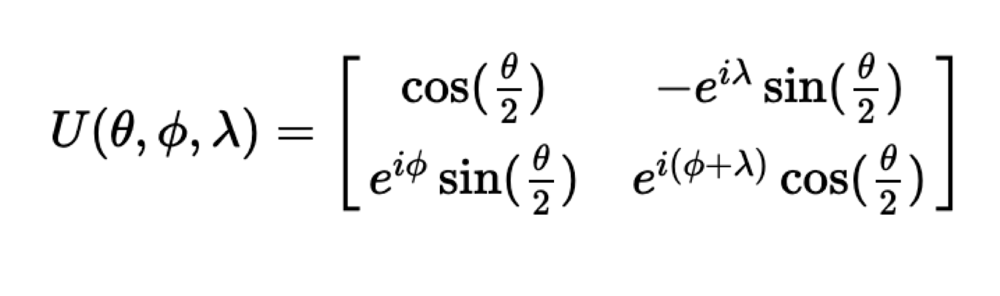

# Lecture 21:  Basics of Quantum Computing

## Note Information

| Title       |Basics of Quantum Computing                                                                             |
|-------------|-----------------------------------------------------------------------------------------------------------------|
| Lecturer    |                     Hanrui Wang                                                                                 |
| Date        | 11/22/2022                                                                                                      |
| Note Author | Tara Boroushaki (tarab)                                                                                      |
| Description |  This lecture covers the basics of Quantum computing that Quantum Machine learning rely on. 

## Section 1: Single qubit state and gates
- A quantum bit is called a qubit (the basic component)

- The number of qubits in quantum devices are increasing exponentially over time. Since the computing power increases exponentially with the number of qubits, the computing power has a doubly exponential growth.

- Qubit x is shown with $|x\rangle$ which is called ket notation (column vector). Qubit x is shown with $\langle x|$ which is called bra notation (row vector). $\langle x|$ is conjugate transpose of $|x\rangle$.

- $|0\rangle,|1\rangle$ are orthonormal basis formulated as:
  
$$ |0\rangle= 
\begin{bmatrix} 
1 \\
0 
\end{bmatrix} $$

$$ |1\rangle= 
\begin{bmatrix} 
0 \\ 
1 
\end{bmatrix} $$

- $|q\rangle$ can be shown as a linear combination of $|0\rangle$ and $|1\rangle$.

- Probability of measuring a state $|\psi\rangle$ in the state $|x\rangle$ is formulated as:

$$P(|x\rangle) = |\langle x|\psi\rangle|^2 $$  

- $|\langle0|\psi\rangle|^2 + |\langle1|\psi\rangle|^2 = 1$

- We can measure qubit's basis other than $|0\rangle,|1\rangle$. There are infinite pairs of bases.

- $i|1\rangle$ and $|1\rangle$ are equivalent in all ways that are physically relevant. Because: $|\langle x|(i|1\rangle)\rangle|^2=|i\langle x|1\rangle|^2 = |\langle x|1\rangle|^2 $

- If we measure a quantum state, it will collapse to a classical state. It means the output is either 0 or 1 (our bases). This means that measuring a quantum state results in the loss of information.

- There are 2 free variables in a state. 

$$ |q\rangle = \cos(\theta)|0\rangle +e^{i\phi}\sin(\theta)|1\rangle$$ $$\theta, \phi \in \mathbb{R}$$

$\theta, \phi$ are the spherical coordinates. Any qubit state is on the surface of this sphere (Bloch sphere).

- All the quantum gates are reversible (no information is lost). The gates are rotations around the Bloch sphere. 

- Pauli Gates:

  Z gate : 
  
$$ Z= \begin{bmatrix} 1 & 0 \\ 
0 & -1 \end{bmatrix} = |0\rangle\langle0|-|1\rangle\langle1| $$

$|0\rangle$ and $|1\rangle$ are eigen-states of Z since if we apply gate Z to them, they stay the same.

X gate : 

$$ X= \begin{bmatrix} 0 & 1 \\ 
1 & 0 
\end{bmatrix} = |0\rangle\langle1|+|1\rangle\langle0| $$

$|+\rangle$  and $|-\rangle$ are eigen-states of X.

Y gate : 

$$ Y= \begin{bmatrix} 0 & -i \\ 
i & 0 
\end{bmatrix} = -i|0\rangle\langle1|+i|1\rangle\langle0| $$

$|R\rangle$  and $|L\rangle$ are eigen-states of Y. $|R\rangle$ is the most right point on Bloch sphere and $|L\rangle$ is the most left point.

- Hadamard Gate: 

$$ H= \frac{1}{\sqrt{2}} 
\begin{bmatrix} 1 & 1 \\ 
1 & -1 
\end{bmatrix} $$

$$ H|0\rangle = |+\rangle$$
$$ H|1\rangle = |-\rangle$$

- U gate can implement all possible gates with three parameters.

- Example: Applying a gate on a single qubit:

$$ X= 
\begin{bmatrix} 
0 & 1 \\ 
1 & 0 
\end{bmatrix}$$

$$ X|0\rangle =
\begin{bmatrix}
0 & 1 \\
1 & 0
\end{bmatrix}

\begin{bmatrix}
1 \\
0
\end{bmatrix}
=
\begin{bmatrix}
0 \\
1
\end{bmatrix}
$$

## Section 2: Multiple qubit states and gates

- n bits will have $2^n$ states vector length.
- Example: Applying gates X and H on multiple qubit state:

$$ X|q_1\rangle  \otimes H|q_0\rangle = (X \otimes H)|q_1q_0\rangle$$

the $ \otimes $ is called a tensor product. More information [here](https://en.wikipedia.org/wiki/Tensor_product).

- CNOT gate: If the $q_0$ is 1, we apply a NOT on $q_1$. If the $q_0$ is 0, no change is made.

- Entangled state: The entangled state of 2 qubit states is created through a gate on the control qubit, followed by a CNOT gate.

- No Communication Theorem: The measurement results are random and it is not possible to transmit classical bits of information by means of carefully prepared  multiple qubit states, whether entangled or not.
 
- Other common multi qubit gates:

## Section 3: Quantum circuit

- Main components of a circuit:
In this figure, 1 line means quantum computation, and 2 lines mean classical computation.

- Half adder circuit: 

- Full adder circuit: 

- [Deutsch-Jozsa Algorithm:](https://qiskit.org/textbook/ch-algorithms/deutsch-jozsa.html) It is the first quantum algorithm that performs better than the best classical algorithm. It showed for the first time that a quantum computer can be better than a classical one. 

## Section 4: NISQ Era and compilation problem

NISQ stands for noisy intermediate-scale quantum.
Basically, it is a term to say that current quantum processors (which have at most several hundreds of qubits) are not good enough to be fault-tolerance or gain anything from quantum computation.
