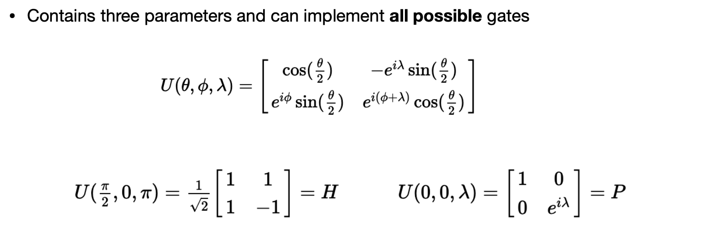
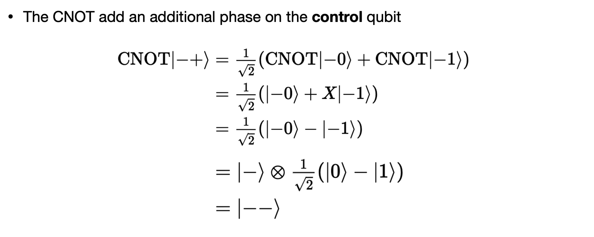

# Lecture 21: Basics of Quantum Computing

## Note Information

| Title       | Basics of Quantum Computing                                  |
| ----------- | ------------------------------------------------------------ |
| Lecturer    | Hanrui Wang, Song Han                                        |
| Date        | 11/22/2022                                                   |
| Note Author | Zijie Zhao (zijiezha)                                        |
| Description | Introduce some basic math of Quantum Computing: Single qubit state and gates; Multiple-qubit state and gates; Quantum circuit; NISQ Era. |

## Introduction

* Fast progress of quantum devices 

* Different technologies 
* Superconducting, trapped ion, neutral atom, photonics, etc.

**Doubly exponential rate**: The number of qubits increases exponentially over time, and the computing power increases exponentially with the number of qubits.

## Single Quantum Bit

> Note: The lecture is just a quick overview. I highly recommend the readers check the IBM Qiskit Textbook: https://qiskit.org/textbook/preface.html for the details.

### Annotations

The basic component of quantum computing is a Quantum Bit (Qubit). And we use the **statevector** to describe the state of the system. In the following [[car example]](https://qiskit.org/textbook).  We use the probability of the car being at a location to describe the state of the car. It's Inefficient in classical but very effective for representing quantum states.

We can easily use either a zero or one to describe a state of one bit. In a Quantum, we're actually using the orthogonal vectors to describe the state of the quantum bit in a bracket notation or dirac notation.

$\ket{0}=\begin{bmatrix}
1 \\
0
\end{bmatrix},\ket{1}=\begin{bmatrix}
0 \\
1
\end{bmatrix} $

We actually can use some complex numbers inside this vector, and we could also construct a linear combination of the two states:

$\ket{q_0}=\begin{bmatrix}
\frac{1}{\sqrt{2}} \\
\frac{i}{\sqrt{2}}
\end{bmatrix} = \frac{1}{\sqrt{2}}\ket{0} + \frac{i}{\sqrt{2}}\ket{1}$

To find the probability of measuring a state $\ket{\phi}$ in the state $\ket{x}$ we do: $p(\ket{x}) = |\langle x | \phi \rangle|^2$

Measure a state in itself should be 1: $\langle \phi | \phi \rangle = 1$

Once we have measured the qubit, we know with certainty what the state of the qubit is: 

$\ket{q} = \alpha \ket{0} + \beta \ket{1}$

The quantum state collapses to a classical state. We will only get a series of classical bits when measuring multiple qubits.

### Bloch Sphere

### Single Qubit Gates

All the quantum gates are reversible. Reversible gates can be represented as matrices or rotations around the Bloch sphere.

Pauli Gates:

Hadamard Gate:

U Gate:

## Multiple Quantum Bits

Now we just naturally extend to the multiple opponent: 

We can also apply the single qubit gate to a multi-qubit system like the following:

**No-communication theorem** 

* The measurement result is random 
* The measurement statistics of one qubit are not affected by any operation on the other qubit 
* It is not possible to use a shared quantum state to communicate

More examples:

## Quantum Circuit

Quantum circuits are collections of quantum gates interconnected by quantum wires. 

An Adder Circuit:

**Deutsch Algorithm:**

Imagine we have a black box that computes a function map a single bit to another single bit $x \mapsto f(x)$.  The computation is complicated, takes 1 day. Now suppose we have a quantum machine that computes f(x). Since quantum computing is unitary and must be invertible, we need a quantum transformation $U_f$ that takes two qubits.

## NISQ Era

In the noisy intermediate-scale quantum (NISQ) era the leading quantum processors contain about 50 to a few hundred qubits, but are not advanced enough to reach fault-tolerance nor large enough to profit sustainably from quantum supremacy.

Features:

* **Noisy**: qubits are sensitive to environment; quantum gates are unreliable;
* **Limited number of qubits**: tens to hundreds of qubits;
* **Limited connectivity**: no all-to-all connections

Qubit Mapping: [[Bochen Tan et al]](https://arxiv.org/pdf/2007.15671.pdf)

## Lecture Summary

In this lecture, we mainly go through the following four parts:

* Introduce single qubit state and gates 
* Introduce multiple-qubit state and gates 
* Introduce quantum circuit 
* Introduce the NISQ Era and compilation problems

