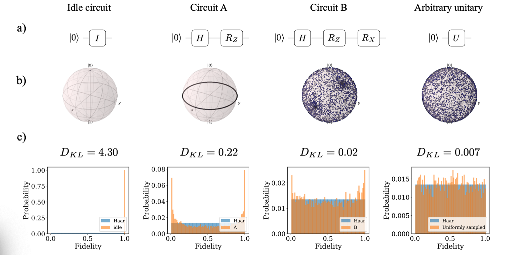
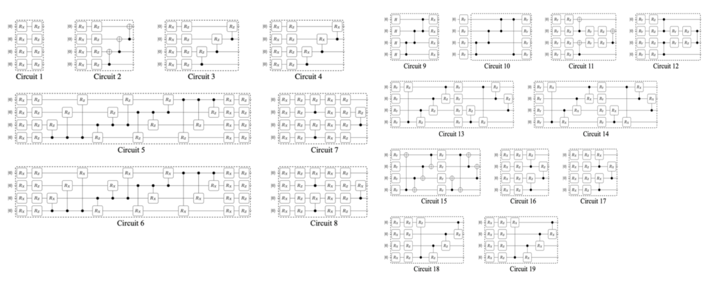
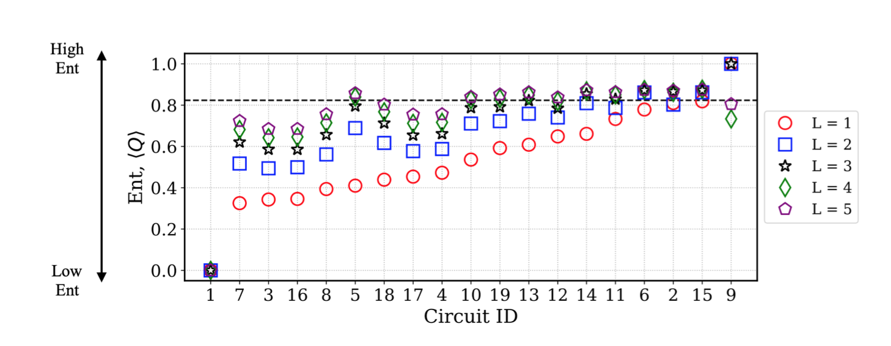

# Lecture 22: Quantum Machine Learning (Part I)

## Note Information

| Title       | Quantum Machine Learning (Part I)                                               |
| ----------- | ------------------------------------------------------------------------------------------------------ |
| Lecturer    | Song Han                                                                                               |
| Date        | 11/29/2022                                                                                             |
| Note Author | Mark Jabbour (mjabbour)                                                                                         |
| Description | This lectures introduces the current state of quantum machine learning 

## Lecture overview
1. NISQ devices
2. Parametrized Quantum Circuit (PQC)
3. PQC training
4. Quantum classifiers
5. Noise aware on chip training (QOC) of PQC
6. TorchQuantum library for QML

### 1. Noisy Intermediate-Scale Quantum devices 

Quantum computers are currently in what's known as the noisy interemediate-scale (NISQ) ERA. They are charecterised by the following limitations:

1. **Noisy:** Current Qubit gates have a very high error rate, on the order of $10^{-3}$.  This makes quantum computing somewhat unreliable, and makes training models challenging
1. **Limited Number of Qubits:** Modern Quantum computers have Qubits on the order of hundreds. While some of the most interesting applications like factorization require millions of Qubits
 
1. **Limited Connectivity:**  Having less connections between Qubits dictates having to add swap operation whenever we wish to perform an operation on none-neighboring Qubits. This complicates the issue of deceiding which logical Qubits are stored in which physical Qubits, also known as Qubit mapping. See an example below:

 
 

### 2. Parametrized Quantum Circuit (PQC)

#### QML approaches

* **CC**: Classical Data, Classical algorithm: The machine learning we know and love

* **CQ**: Classical Data, Quantum algorithm: The main focus here, using quantum computing to make inference on classical data

* **QC**: Quantum Data, Classical algorithm: Mostly used to aid in quantum computers. Solves problems like: qubit control, calibration, readout...

* **QQ**: Quantum Data, Quantum algorithm: process quantum info with quantum machine

 

#### Definition of a Parametrized Quantum Circuit

Quantum algorithms can be described as quantum circuits. In which some gates are fixed like the Hadamard or swap gates, and others have tunable parameters like rotations. Below is an example:

 

#### Expressivity of a Quantum circuit

Similar to how we study the power of a traditional model by it's ability to approximate other functions. One way to study the power of a quantum model is by it's expressivity; how much of the Hilbert space it covers. More specifically we measure the KL divergence of the output of 1 when given to a random model from a uniformly random point on the Hilbert space. See some examples below:

 

#### Entanglement capability of a Quantum circuit

An altertnative measurement for the power of a quantum model is it's entanglment capacity. The Meyer-wallach measure tells how entangled a given state is with a number in [0, 1], with unentangled state being 0, and entangled state being 1. We use the average   Meyer-wallach (**averaged MW**)  to measure the entanglement capability of circuit.

For instance below is a selection of circuit, and their average Meyer-wallach measures with different accross a different number of layers L. As we can see increasing the numebr of layers increases entanglment.

 

 

#### Hardware Effeciency consideration

Optimizing quantum circuits is a tricky problem. one thing that we try to do is minimie the number of swap gates. Another thing that matters is whether the gates we are applying are native to the machine we are deploying on or not.

#### Encoding

