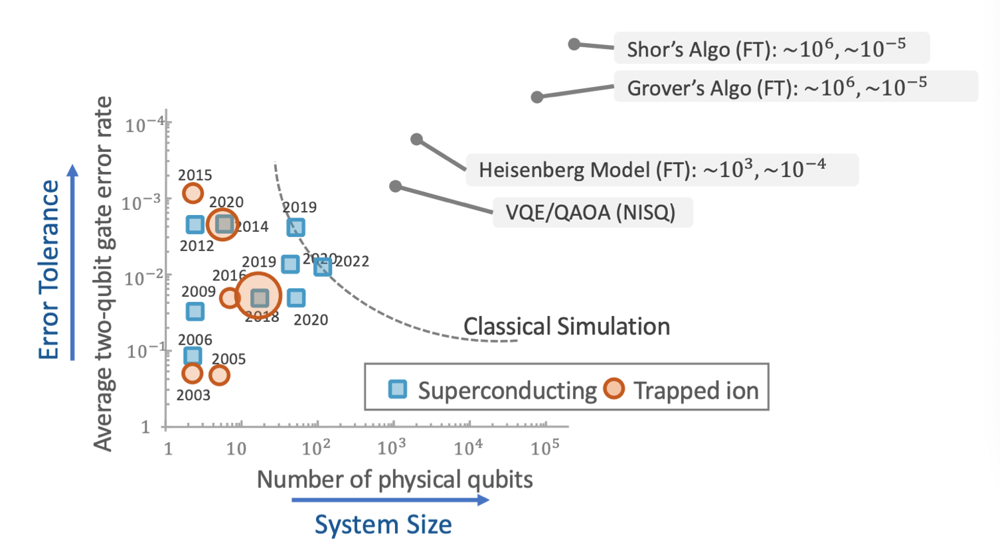
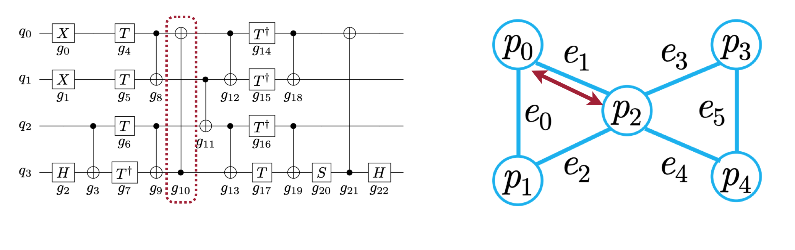
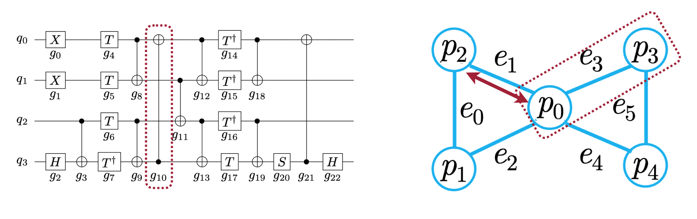
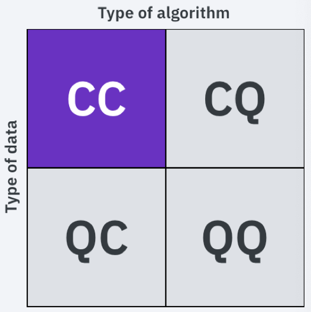
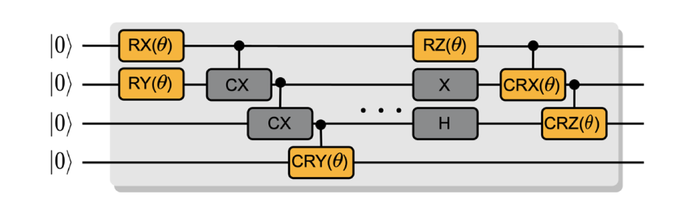

# Lecture 22: Quantum Machine Learning (Part I)

## Note Information

| Title       | Quantum Machine Learning (Part I)                                               |
| ----------- | ------------------------------------------------------------------------------------------------------ |
| Lecturer    | Song Han                                                                                               |
| Date        | 11/29/2022                                                                                             |
| Note Author | Mark Jabbour (mjabbour)                                                                                         |
| Description | This lectures introduces the current state of quantum machine learning 

## Lecture overview
1. NISQ devices
2. Parametrized Quantum Circuit (PQC)
3. PQC training
4. Quantum classifiers
5. Noise aware on chip training (QOC) of PQC
6. TorchQuantum library for QML

### 1. Noisy Intermediate-Scale Quantum devices 

Quantum computers are currently in what's known as the noisy interemediate-scale (NISQ) ERA. They are charecterised by the following limitations:

1. **Noisy:** Current Qubit gates have a very high error rate, on the order of $10^{-3}$.  This makes quantum computing somewhat unreliable, and makes training models challenging
1. **Limited Number of Qubits:** Modern Quantum computers have Qubits on the order of hundreds. While some of the most interesting applications like factorization require millions of Qubits
 
1. **Limited Connectivity:**  Having less connections between Qubits dictates having to add swap operation whenever we wish to perform an operation on none-neighboring Qubits. This complicates the issue of deceiding which logical Qubits are stored in which physical Qubits, also known as Qubit mapping. See an example below:

 
 

### 2. Parametrized Quantum Circuit (PQC)

#### QML approaches

* **CC**: Classical Data, Classical algorithm: The machine learning we know and love

* **CQ**: Classical Data, Quantum algorithm: The main focus here, using quantum computing to make inference on classical data

* **QC**: Quantum Data, Classical algorithm: Mostly used to aid in quantum computers. Solves problems like: qubit control, calibration, readout...

* **QQ**: Quantum Data, Quantum algorithm: process quantum info with quantum machine

 

#### Definition of a Parametrized Quantum Circuit

Quantum algorithms can be described as quantum circuits. In which some gates are fixed like the Hadamard or swap gates, and others are tunable like rotations. Below is an example:

 

#### Expressivity of a Quantum circuit

#### Entanglement capability of a Quantum circuit

#### Encoding

