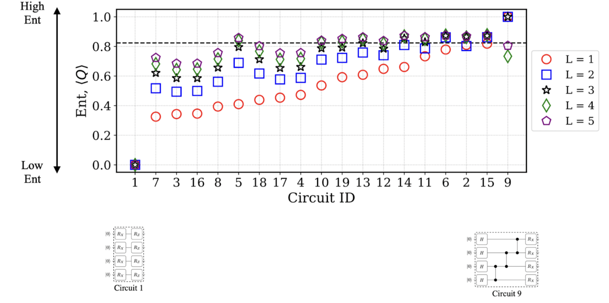

# Lecture 22: MCUNet - Tiny Neural Network Design for Microcontrollers

## Note Information

| Title       | Quantum Machine Learning                                                 |
|-------------|-----------------------------------------------------------------------------------------------------------------|
| Lecturer    | Hanrui Wang, Song Han                                                                                                       |
| Date        | 11/29/2022                                                                                                      |
| Note Author | Nazish Naeem (nazishn)                                                                                                 |
| Description | Introduction of Quantum Machine Learning 

## Section1:NISQ Devices
Today we are in a Noisy Intermediate Scale Quantum(NISQ) era. This is because 
1. the qubits are very sensitive to the environment and quantum gates are very unreliable. 
2. We have limited number of qbits available.
3. Does not have all-to-all conections.
4. There is a large gap between the algorithm and devices available. For a meaningful algorithm the number of qubits required increases by a lot number. The following plot shows the number of physical qbits and the error tolerance of an algorithm.

Similarly there is an overhead when it comes to making connections between different qbits (Qbit Mapping). Researches have been working to reduce this overhead to make quantum computing feasible. 
## Section2: Parameterized Quantum Circuit(PQC)
There are four Quantum Machine Learning (QML) Approaches.
1. Classical Data Classical Algorithm (CC): Processing classical data with a classical computing approach. All the algorithms we have studied so far fall into this category.
2. Classical Data Quantum Algorithm (CQ): Processing classical data with a quantum computing approach. In the following sections, we will read about it in more detail.
3. Quantum Data Classical Algorithm (QC): processing quantum information with a classical computing approach
4. Quantum Data Quantum Algorithm (QQ): Processing quantum information with quantum computing
### PQC Features:
We need quantum circuits for quantum computations. These circuits contain both fixed gates and parameterized gates. Following are some of the features of these circuits:
1. Expressivity: Similar to classical machine learning, expressivity in quantum machine learning is the ability of a quantum circuit to cover the Hilbert Space i.e., the extent to which the states generated by a circuit deviate from the uniform distribution.
In the below example, circuit B covers more Hilbert space than A, hence the expressivity of B is greater than A.

KL divergence of a quantum circuit is inversely related to its expressivity. The figure below shows the circuits from least to greatest expressivity (from left to right) along with their Hilbert space representation and KL divergence.

2. Entanglement Capability: It is the measure of how entangled a given state is. Entanglement is measured using Meyer-Wallach(WL) measure. If a WL measure is 0, this means the state is unentangled whereas a measure of 1 means fully entangled space. To measure the entanglement capability of a circuit an average WL measure of all states is used.

The figure above shows the entanglement capability of different quantum circuits. L here represents the number of layers. The plot shows the entanglement capability of different circuits when with different numbers of layers.
3. Hardware Efficiency: The hardware efficiency of a quantum circuit is a measure of whether a PQC design considers qubit connectivity or whether the gates used in a circuit are native quantum gates.

### Data Encoding:
For performing Quantum Machine Learning(QML) on a Classical Dataset, the data needs to be encoded before loading. In this section, we will learn about different types of data encodings for classical data before loading them into a quantum machine.
1. Basis Encoding: Similar to binary representation in classical machines, quantum states are used to represent classical data. This representation can help in decoding multiple data simultaneously using one set of qubits (it can be thought of as a superposition of multiple states)
2. Amplitude Encoding: For input vectors of arbitrary numbers like v = [0.8,0.2,0.3], we use amplitude encoding to encode in qbits. The qubit vector needs to be normalized to maintain the unit magnitude of the qubit vector. In this kind of encoding, it is also possible to encode multiple data in a single vector. One problem with this encoding technique is that it uses very complicated circuits to convert/encode data to an arbitrary state which makes this approach impractical for large inputs
3. Angle Encoding: Angle encoding encodes the data in the rotation angles of the qubit gates. The theta value in the vector corresponds to the input value
4. Arbitrary Encoding: This type of encoding requires designing an arbitrary parameterized quantum circuit and letting input data as the rotation angles.
## Section3: Parameterized Quantum Training
PQC training is very similar to training in classical machine learning models. In PQC training we train the parameters in parameterized quantum circuits to perform data driven tasks. For performing parameter optimization or training we need gradients. Following are three types of gradients.
1. Finite Difference Gradient: These types of gradients work indepent of the loss function structure. The accuracy of such method highly depends on the step size (epsilon) used for finite gradient, as shown below:

2. Parameter Shift Gradient: It is one of the most accurate gradient calculation methods that does not require to know the actual loss function structure. This method only requires to shift input angle twice by +90 degrees and -90 degrees as shown below. The methodical proof can be found in the lecture slides.

3. Back Propagation: The gradients can also be calculated using back propagation. These can only be run on a classical simulator since all the computations are basically differentiable linear algebra.
### Calculating a PQC Gradients:
General flow of calculating a PQC gradients is as follows:
* Step 1: Run on QC without shift to obtain f
* Step 2: Further forward to get Loss
* Step 3: Backpropagation to calculate ∂(Loss)/∂f(θ)
* Step 4: Use Parameter Shift Gradient / Finite Difference Gradient
* Step 5: By Chain Rule: 	∂Loss/∂f(θ) · ∂f(θ)/∂θ_i = ∂Loss/(∂θ_i ), sum over 4 passes (4 qubits) 
All these steps combined are shown below:

### Training Techniques:
There are two types of training techniques:
* SPSA: For parameter shift gradients, we have to do computations twice to compute the gradient. SPSA does both computations simultaneously and shgow results similar to that of gradient descent.

* Barren Plateau: it is a vanishing gradient problem when the circuit beacomes too large. This is because the variance of the parameters and gradients decreases as we use more qbits. The plot below shows the variance of the gradients as a function of number of qbits when we have constant depth and linear depth.

## Section4: Quantum Classifiers
With QNNs we can build quantum classifiers. The lecture slide shows QNN used for MNIST classification, VQE, and QAOA.
## Section5: Noise Aware On-Chip Training (QOC)
In Quantum Computing a very little noise can introduce huge amount of errors. The following figure compares the effect of noise on the gradients between classical and quantum gradient computation.

### Probabilitis Gradient Pruning:
It is observed that small magnitude gradients have large relative errors. We can do probabilistic pruning of such gradients to make the gradient computation more reliable. We use the history of the gradients as an indicatore of reliability of the gradients and sample some parameters in order to freeze them in for gradient calculations in some steps. This help with the probabilistic pruning aslo known as accumulation and pruining. The complete process of accumulation and pruning involves window based accumulation and pruning.
### Evaluation of gradient pruning:
* Benchmarks
  * Quantum Machine Learning task: MNIST 4-class, 2-class, Fashion MNIST 4-class, 2-class, vowel 4-class
  * Variational Quantum Eigensolver task: H2 molecule
* Quantum Devices
  * IBMQ
  * #Qubits: 5 to 7
  * Quantum Volume: 8 to 32
* Circuit architecture
  * RZZ+RY, RXYZ+CZ, RZX+RXX
### Classification Results:
Gradient achieves similar results to classical simulation

Gradient pruning can bring 2%~4% accuracy improvements and accelerate convergence with 2x training time reduction as can be seen in the plot below.

### VQE Results:
Gradient pruning can reduce the gap between quantum and classical

### Scalability:
This also makes on-chip training scalable

### Probabilistic vs deterministic pruning:
Here is the comparison between probabilistic and deterministic pruning.

For quantumML, TorchQuantum is a fast classical simulation of quantum circuits.
