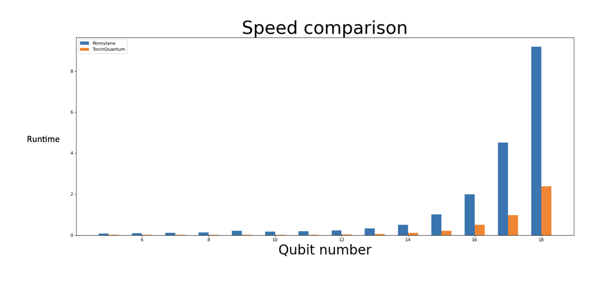

# Lecture 23: Noise-Robust Quantum Machine Learning

# Note Information

| Title | Noise-Robust Quantum Machine Learning |
| --- | --- |
| Lecturer | Hanrui Wang, Song Han |
| Date | Dec 02, 2022 |
| Note Author | William Zhao (wzhao6) |
| Description | Introduces NAS for quantum ML, and methods to make quantum ML robust to noise. In particular, introduces QuantumNAS, which uses a super-network and evolutionary co-search of network architecture and hardware mapping. Also introduce post-measurement normalization and noise injection to combat the noise in real quantum computing devices. |

# Lecture Outline

1. Continue TorchQuantum examples
2. Introduce robust parametrized quantum circuits (PQC) architecture search
3. Introduce robust PQC parameter training

# TorchQuantum (Continued)

Recall that in last lecture, we saw how to use TorchQuantum to construct quantum circuits. Here we describe some specific elements in TorchQuantum:

- tq.QuantumDevice stores the statevectors of a circuit:

```python
import torchquantum as tq
q_dev = tq.QuantumDevice(n_wires=5)
```

- There’re two ways of applying quantum gates:

```python
# Method 1: Functional form
import torchquantum.functional as tqf
tqf.h(q_dev, wires=1)

# Method 2: Module form
h_gate = tq.H()
h_gate(q_dev, wires=3)
```

- tq.QuantumState can also store the statevectors, but supports more syntax than tq.QuantumDevice:

```python
q_state = tq.QuantumState(n_wires=5)

# H gate, method 1
tqf.h(q_state, wires=1) 

# H gate, method 2
h_gate = tq.H()
h_gate(q_state)

# H gate, method 3
q_state.h()

# R_X gate
q_state.rx(wires=1, params=0.2 * np.pi)
```

- TQ works by performing matrix-vector multiplication between gate matrix and statevector, using native data structures in PyTorch. For example, the implementation of states and gates are:

```python
_state = torch.zeros(2 ** self.n_wires, dtype=C_DTYPE)
_state[0] = 1 + 0j
'cnot': torch.tensor([[1, 0, 0, 0],
											[0, 1, 0, 0],
											[0, 0, 0, 1], 
											[0, 0, 1, 0]], dtype=C_DTYPE)
```

- TQ uses a eager execution / dynamic computation graph, so we can see the value of the quantum states at any time during the execution:

```python
q_state.h(wires=1)
print(q_state)
q_state.sx(wires=3)
print(q_state)
```

- TQ supports batch mode tensorized processing, so all the computations are tensorized:

```python
q_state = tq.QuantumState(n_wires=5, bsz=64)
```

- Fast GPU support in TQ

```python
q_state.to(torch.device('cuda'))
```

- Automatic gradient computation in the same way

```python
q_state = tq.QuantumState(n_wires=2)
target_q_state = torch.tensor([0,0,0,1])
loss = 1 - (q_state.get_states_1d()[0] @ target_q_state).abs()
loss.backward()
```

- How to encode classical data as quantum states. TQ supports different native encoders

```python
tq.AmplitudeEncoder() # encodes classical values as amplitudes of statevector
tq.PhaseEncoder() # encodes classical values as angles in rotation gates
```

- TQ modules can be converted into other frameworks, such as Qiskit. Then we can deploy the Qiskit circuit on real devices such as IBM Quantum

```python
from torchquantum.plugins.qiskit_plugin import tq2qiskit
circ = tq2qiskit(q_dev, q_model)
circ.draw('mpl')
```

Why do we use TorchQuantum framework? It has significant speedup over other frameworks. For example, we have a 4-5 times speedup compared to Pennylane when the qubit number increases.



As we increase the layers in the circuit, the speedup is also significant.


Finally, due to batch size support, we see that as we increase the batch size, the time to run TQ on GPU is near constant, but increases linearly in Pennylane


# Robust Quantum Circuit Architecture Search

How do we design the architecture for PQCs? For PQC we have some fixed gates (grey) and parametrized gates (orange). PQCs are useful in many **hybrid classical-quantum models** such as the VQE (variational quantum encoder) and QAOA (quantum approximate optimization algorithm).


## Challenges of PQC - Noise

Noise degrades ************************************PQC reliability. In particular, noise scales with the number of parameters in the PQC, so having more parameters will **increase the noise-free accuracy** (due to increased learning capacity) but **degrade the measures accuracy** on real-device. Since we’re limited by the number of parameters, it’s critical to have good circuit architecture.


## Challenges of PQC - Large Design Space

- Many different kinds of gates (e.g. CU3 vs CZ)
- Number of gates can vary
- Location of gates can also be different, which gates come first?


## QuantumNAS Framework

We use a “SuperCircuit” to efficiently search circuits without training. Then, we use quantum noise-feedback and search qubit mapping to make our circuits noise-robust. This is summarized in 4 steps:


1. SuperCircuit construction and training
2. Noise-adaptive evolutionary co-search of subcircuit and qubit mapping
3. Training subcircuit
4. Iterative quantum gate pruning

## 1. Supercircuit and subcircuit

We use a similar philosophy as One-For-All for NAS. We first construct a design space so we can decide what is the maximum number of gates. The supercircuit is the **circuit in design space with most gates.** 

- Example, SuperCircuit in U3 + CU3 space


Each candidate circuit is a subset of the supercircuit.


By using the SuperCircuit framework, we don’t need to train each SubCircuit each time during the search. We can just train the SuperCircuit for once at the start. Then, we use **inherited parameters** to directly evaluate SubCircuits. This works since there’s a large **positive correlation** between the performance of SubCircuits with inherited parameters, and those trained from scratch. (Shown later)

To train of SuperCircuit, at each training step, we do:

1. Sample a gate subset (SubCircuit)
    1. Use front sampling or restricted sampling
2. Only use the subset to perform the task, and update parameters in the subset
3. Parameter updates are cumulative across the steps


### How do we sample subcircuits?

In order to make the training process stable, we cannot use uniformly random sampling. There’re two possible methods of sampling.

The SuperCircuit gates are organized in blocks. During sampling, we first select the total number of blocks, then sample the gates within each block

1. Front sampling. Only the front several blocks and front several gates can be sampled 


1. Restricted sampling. Restrict the differences between different subsets within 2 consecutive steps. For example, we can restrict that only 4 of the blocks can be altered each time, when the SuperCircuit has 6 blocks.


Example training of SuperCircuit for multiple steps. We update a different subset each time.


### How reliable is the SuperCircuit?

The inherited parameters have high **rank correlation** with the trained from scratch parameters on performance 


## 2. Noise Adaptive Evolutionary Search

We actually need to co-search both the architecture of the circuit, and the qubit mapping between the circuit gates and the actual qubits. Recall the qubits on real devices are sparsely connected, so we’re trying to avoid noisy and slow swap operations needed for gates on qubits which are far apart. 

We evaluate the candidates with either deployment on a real-device, or use a simulated noise model to pick noise-robust candidates.


Evolution search means that we use a gene to represent each circuit-mapping pair. At each iteration, we can use either a mutation or a crossover from the previous iteration’s candidates to generate new candidates.

1. Mutation: we can randomly mutate some blocks in the previous candidate
2. Using 2 parent candidates, we randomly choose a subset of blocks from each parent and put them together to make the cross-over.


## 3. Iterative Quantum Gate Pruning

This step is a stand-alone technique that can be applied to any PQC.

We observe that some parameters close to 0. Note that rotation gates with angles close to 0 have small impact on the results. For example, rotation with angle 0 is just identity, which has no impact on results.


We can iteratively prune small-magnitude gates and fine-tune the remaining parameters.

Unlike in classical ML, accuracy might even increase after pruning the PQC, since we eliminated noise from the pruned gates.

## Evaluation

Benchmarks:

1. QML classification tasks: MNIST 10/4/2-class, FashionMNIST 4/2-class, Vowel 4-class
2. VQE task: Finding the smallest eigenvalue of the Hamiltonian matrices for different molecules. Molecules includes H2, H2O, LiH, CH4, BeH2.


IBM Quantum devices used:

1. #Qubits: 5 - 65
2. Quantum Volume: 8 - 128

MNIST-4 U3+CU3 on IBMQ-Yorktown: accuracy vs # parameters


H2 VQE task with different design spaces and search methods on IBMQ-Yorktown 


With QuantumNAS, we can scale to large number of qubits. E.g. MNIST-10 accuracy vs. #qubits. Note that we still have a long way to go on solving noise impact, since these models achieve **80% accuracy noise-free, but 30% with noise.**


Quantum Gate Pruning consistently improves accuracy for MNIST-4, by 3% on average.


The time to search is reduced 1600x compared to the naive random search. (Nvidia Titan RTX 2080 ti GPU)


## Other Search Frameworks

We can use graph transformers to estimate the circuit fidelity (i.e., estimate the degradation due to noise). We can get ground-truth data on by applying the inverse circuit. Then, the expected noise-free behavior is just identity map, so deviations away is caused by the noise in the quantum circuits.


The architecture is graph transformers. We can use different types of nodes to represent different types of gates, and the edges between the nodes represent the input-output relationships between the gates. THe graph transformer model consists of attention layers and a final regression layer.


Another method is to represent the circuits using an image. We represent the qubits as rows in the image and gates as columns. Then we can use any convolution neural networks to process the image representation of circuits.


We can also use RL to generate the candidates for each step, instead of evolutionary search. The reward to the RL agent come from the performance of the generated circuits. 


Differential search, similar to DAS can also be used. We have a differentiable searcher generate circuits from evaluation pool, and the performance is differentiable over choice of subcircuit.


Another search framework is similar to QuantumNAS, but instead of evolutionary search, they just simply ranked their candidates. But the number of candidates to rank grows exponentially, so their work is limited on smaller search spaces.


# Robust PQC Parameter Training

We can also improve noise robustness through the training process, not just the architecture. 

First, we introduce the **multi-node** QNN. Previously, we have only one measure at the end. But here we can do measurement, and the **re-encode** into quantum domain, then we can have another node in the PQC. Here, we can control the noise since at each node, the number of qubits is small. If there’re too many qubits in one node, then the error accumulates and the results is unsatisfactory.


Here, we can do some error-removal in between each node using classical methods. So the tradeoff here is between large capacity and noise. By error-removing using classical methods, we reduce the noise, but also loses some capacity.

## Post-Measurement Normalization

One way to error-mitigation between nodes is to normalize along the batch dimension, similar to batch normalization. We compute the mean and std of measurement outcome on each qubit across batch dimension, then we normalize this row of outcomes using these computed mean and std.


We measure the outcome distribution for 50 different quantum circuits using a histogram, comparing the final results of real devices against noise-free simulations. We see that difference between the outcomes is reduced. There’s actually a theoretical proof for this statistic that post-measurement normalization has better fidelity.


## Noise Injection

In adversarial attack literature, we can alleviate adversarial attacks by injecting noise into the input data. Inspired by this, we can also inject noise into the PQC during training, so that the parameters will be familiar with what noise looks like, so the resulting circuit is more robust to real-devices.

There’re two kinds of noise:

1. **Readout Error**. In theory, if an output qubit is in the |0> state, its readout should return 0 with 100% certainty since it’s a clear state with no superposition. However, in practice there’s still a chance to measure the 1 state. This is the readout error. There is similar effect when the output qubit is in |1> state. We can present the magnitude of readout error using the confusion matrix, which shows the probability of reading out a 1 from a |0> state and 0 from a |1> state
2. We can apply readout error during training by switching the final output randomly according to the confusion matrix.
3. **Pauli Error.** We can unify all the error in the gates to Pauli error, which applies a random Pauli gate with some probability after each operation. We can present the strength of Pauli error with the probability of adding different Pauli gates after each operation.
4. During training, we can randomly inject Pauli gates after operations. We also sometimes inject the Pauli gates at the control qubits. 


## Post-Measurement Quantization

We quantize measured outcomes. This denoises the PQC by mitigating the small errors. 


The only remaining error is the quantization error, which depends on how close the output qubits are to quantization centroids. We can include an extra loss term to encourage the the final outcome to be closer to the centroids, as shown below.


We see that with post-measurement quantization, we can decrease MSE and increase SNR. After quantization, most qubits have no error, but some have a large error, but MSE and SNR both improved.


## Evaluation

1. QML: MNIST 10/4/2 class, FashionMNIST 10/4/2 class, Vowel 4 class, CIFAR 2 class
2. Use IBMQ devices:
    1. #Qubits: 5 - 15
    2. Quantum Volume: 8 - 32

On IBMQ Santiago device: normalization, noise injection and quantization all improve accuracy. (Note the accuracies in the table accumulates the improvement techniques)


Visualization of feature space on MNIST-2: Because we use 2 qubits, we have just 2 features. We see that in baseline, all the features are squeezed around 0, so there’s not a lot of information in the qubits, and everything will get the same classification. Post-measurement normalization and noise injection spreads out the distribution and improves accuracy. 


# Quantum Devices

Note that most of our experiments are performed on IBMQ, which are superconducting devices. In general, there’re 3 mainstream types of quantum devices right now:

1. Super-conducting device. We fabricate qubits using silicon technology. 
    1. Pro: All qubits can be fabricated using the current foundry technologies
    2. Con: The qubits are not identical. Since the qubits are large devices, we can’t make sure that they’re the same. This will accumulate noise
2. Trapped ion. Use a magnetic field to trap small ions to control their locations, apply lasers to them.
    1. Pro: All qubits are just electrons, so they’re perfectly identical.
    2. Con: It’s difficult to control the electrons. For example, we need 1 million lasers to control 1 million qubits.
3. Vacuum chamber. Atoms don’t carry any electrons or charge, they’re just contained in vacuum chambers. We can also control their locations using lasers. 

# Summary

In this lecture, we learned:

1. TorchQuantum usage (continued)
2. Robust PQC architecture search
3. Robust PQC parameter training.